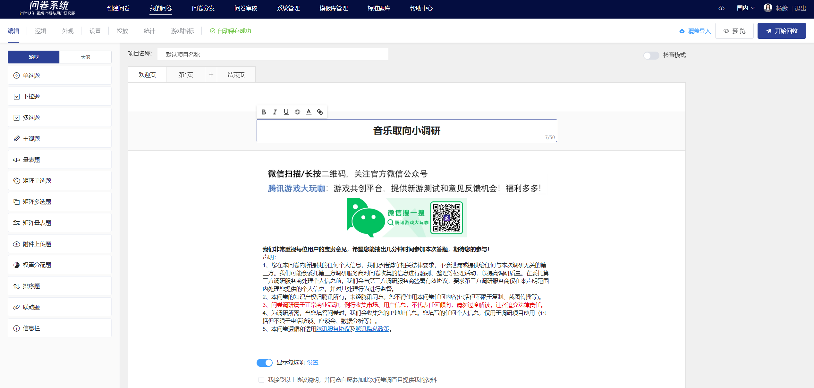

# Survey Title Edit

### Edit survey title text content

On the welcome page, click on the survey title edit box to modify the survey title text. After editing, click on a blank area to

Keep the survey title under 50 characters.

Adjust the survey title font style

After selecting the text, click on the rich text toolbar's style options to change the selected text to the desired style. Styles include bold, italics, underline, strikethrough, and font color.

.png>)

## 插入超链接

问卷标题支持插入超链接功能。


[cha-ru-chao-lian-jie.md](../../../cao-zuo-zhi-yin/wen-juan-bian-ji/cha-ru-chao-lian-jie.md)

