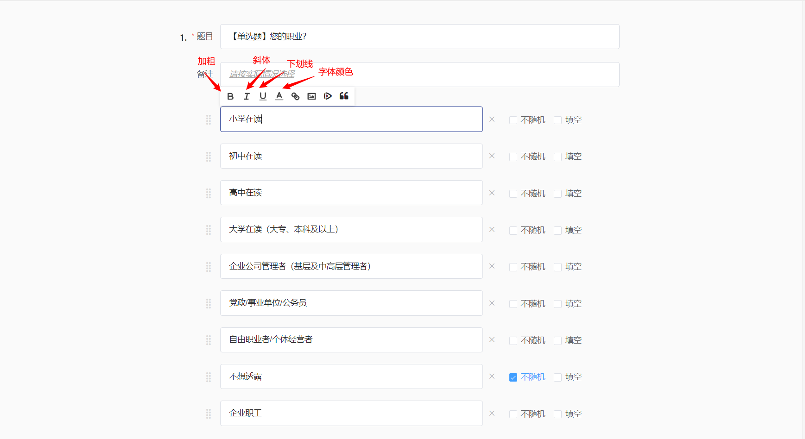
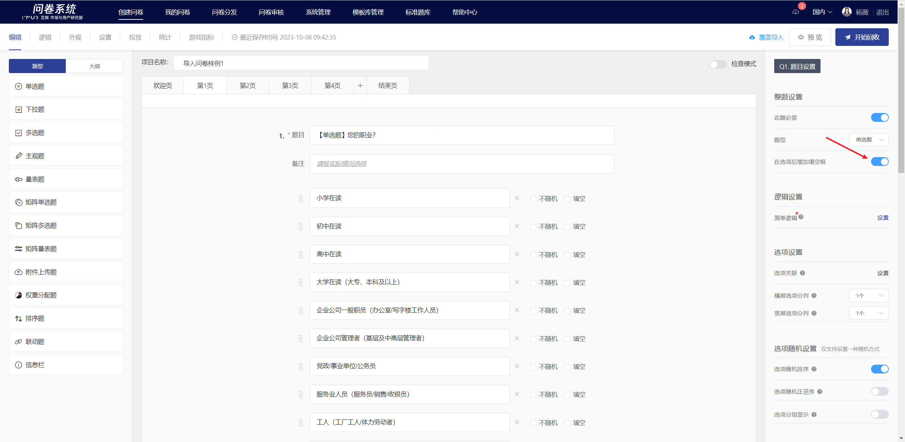
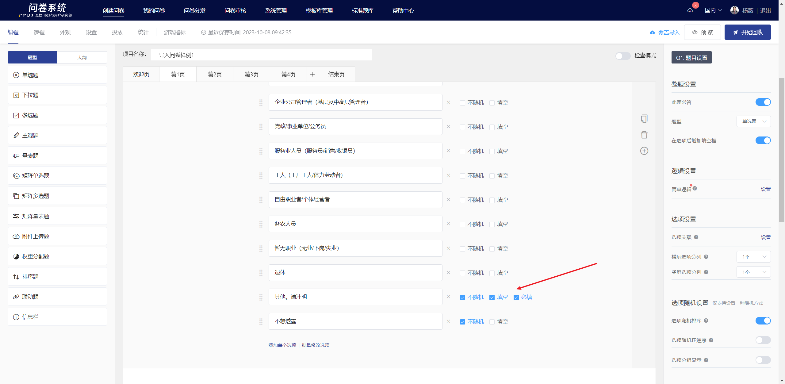
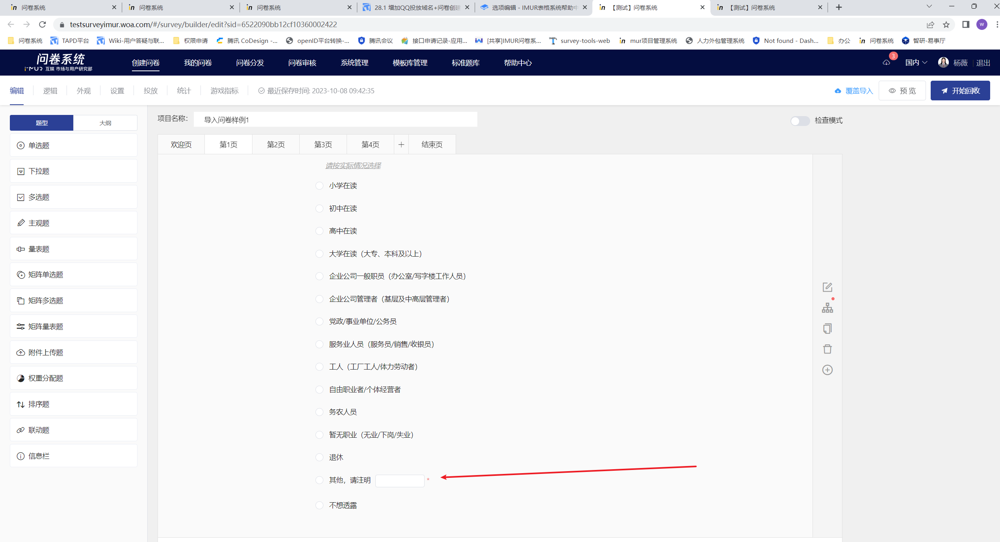
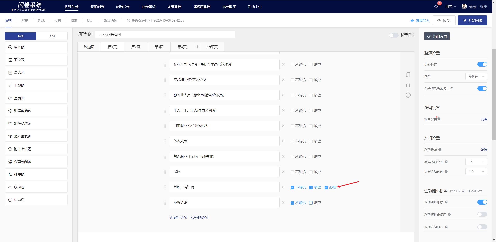
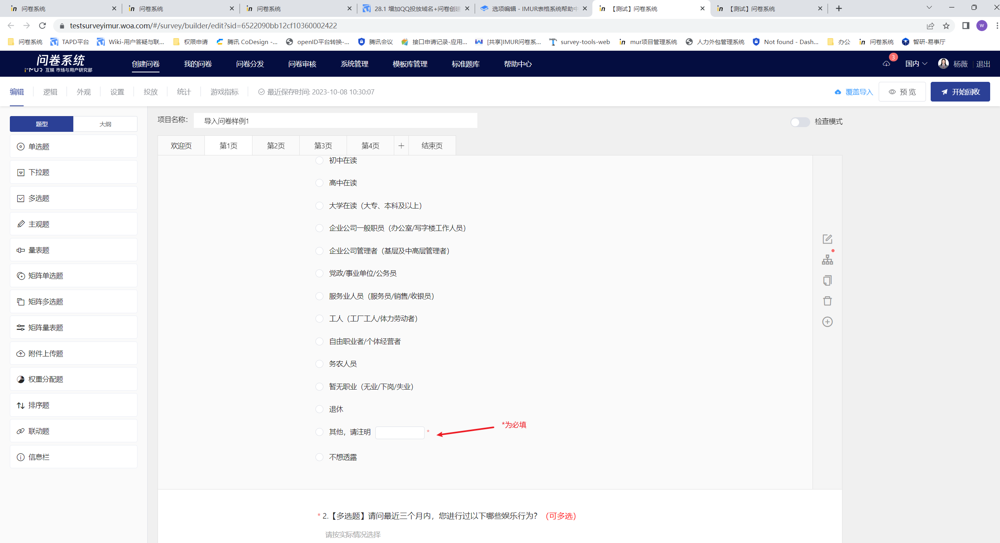

# 选项编辑

## 编辑选项内容

在题目编辑状态下，可自由修改选项的文本及字体样式。

### 修改选项文本内容

1. 在选项编辑框修改选项的文本内容

.png>)

&#x20;  2.在批量修改选项弹窗中修改

.png>)

### 调整选项字体样式

选定文本后，点击富文本工具栏中的字体样式即把选中的文本改成对应的字体样式。文本样式包括：加粗、斜体、下划线、字体颜色。

## 设置填空

在题目编辑状态下，可为指定选项设置填空框及该填空框是否必填；设置成功后，答题端的对应选项显示填空框及必填标记。


从前序题目关联下来的选项不支持设置填空。


### 指定选项设置填空框

#### 【STEP 1】启用填空设置

在题目编辑状态下，右侧“题目设置”面板中开启“在选项后增加填空框”功能。

【STEP 2】指定选项

开启“在选项后增加填空框”功能后，该题每个选项后方显示“填空”勾选框，勾选需增加填空框的选项后方的“填空”勾选框后，该选项后会自动增加填空框。

### 设置必填项

已开启显示填空框的选项，后方会显示“必填”勾选框，勾选即设置该选项的填空框为必填。

### 答题端显示

