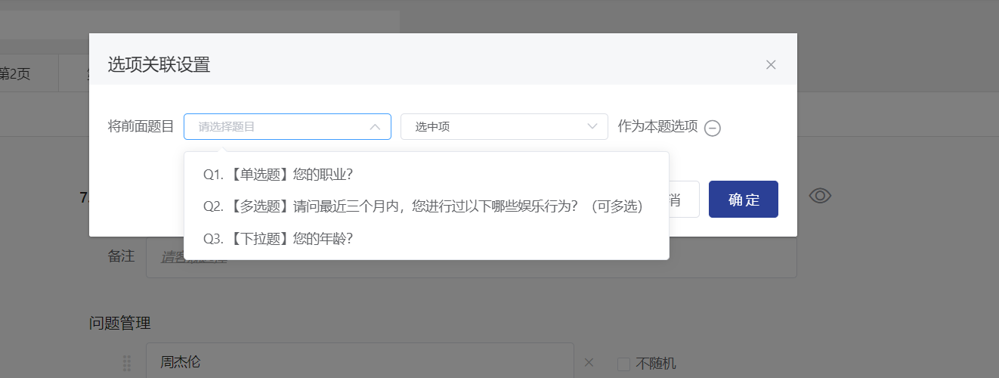

# Choice Association

Option association means that the selected (or unselected) options by the respondent will appear as options in the next question. This is generally used in cases where two questions are highly related or in follow-up questions.


The options linked from the previous question do not support setting fill-in-the-blank, mutual exclusivity, or randomization.


### 【STEP 1】Display Settings Popup

In the question editing state, click the "Settings" button next to "Option Association" in the question settings panel on the right, and the option association settings popup will appear.

<figure><figcaption></figcaption></figure>

### 【STEP 2】 Add Association/Remove Association

### Add Association

In the options association settings popup, after clicking the "Add Association" button, a dropdown menu for question and option settings will be displayed.

.png>)

.png>)

Click to expand the question dropdown menu and select a question.


Only supports selecting single-choice /multiple-choice /drop-down&#x20;


Click to expand the options settings dropdown menu, and select "Selected Items" / "Unselected Items".

.png>)

Click OK to complete the setup.

<figure><figcaption></figcaption></figure>

### Remove association

Click in the option association settings popup - to remove the option association settings.

.png>)

## Survey Interface Display

After setting the option association, the options of the question will change according to the options of the associated question when answering.

.png>)

