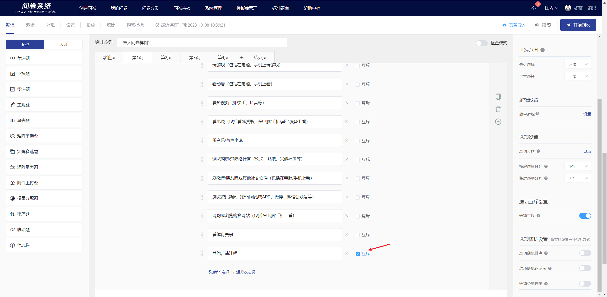

# Mutually Exclusive Options

In the question editing state of a multiple-choice question, you can set mutually exclusive options. Once an option is set as mutually exclusive, selecting this option during the survey will prevent the selection of other options in the same question.


The options linked from the previous question do not support mutually exclusive settings.


## Set mutually exclusive options

### 【STEP 1】Enable Mutex Settings

In the editing state of a multiple-choice question, enable the "Mutually Exclusive Options" feature in the "Question Settings" panel on the right.

### 【STEP 2】Specify Options

After enabling the "Option Mutually Exclusive" feature, a "Mutually Exclusive" checkbox will appear next to each option for this question. Check the "Mutually Exclusive" checkbox next to the options that need to be set as mutually exclusive to complete the setup.

> #### \[Example]
>
> Multiple-choice question Q1 has options A, B, C, and D. Options C and D are set as mutually exclusive options, so the possible situations when users answer the question are: AB, A, B, C, D.
>
> (i.e.: If the user selects C, they cannot choose any of A, B, or D; if the user selects D, they cannot choose any of A, B, or C)

### Survey Interface Display

When the user selects a mutually exclusive option, the other options are disabled and cannot be selected.

.png>)

