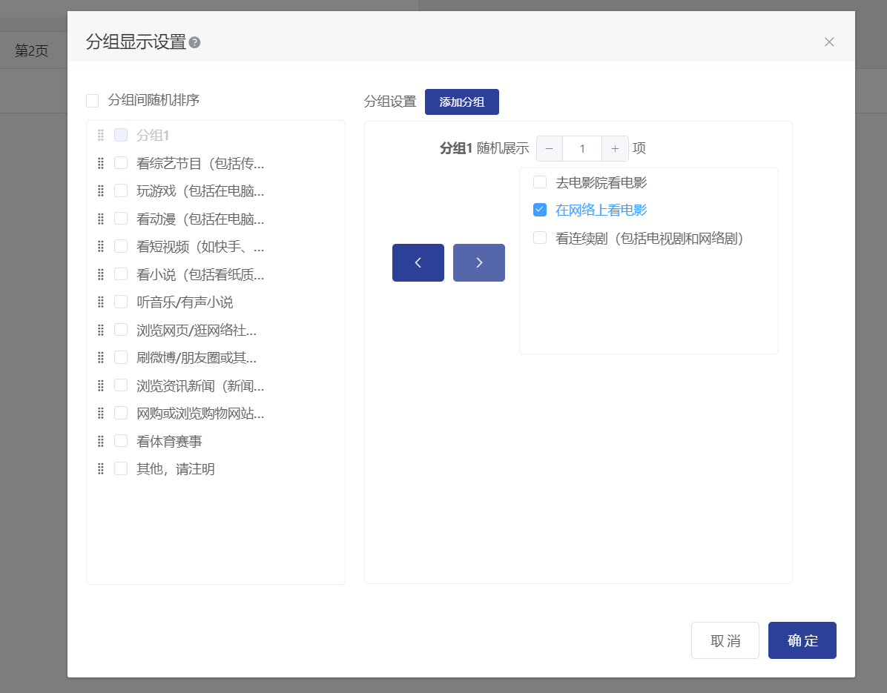
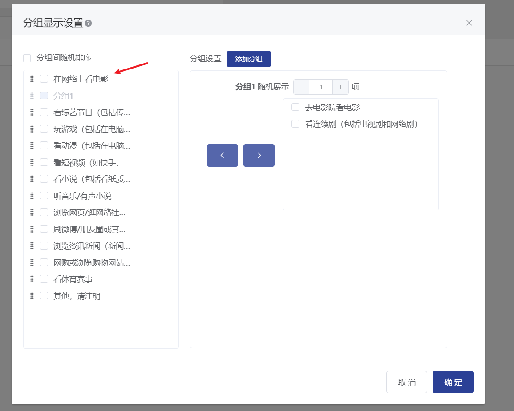

# Options are random

In the question editing state, options can be set to random. Once set successfully, the options will be displayed in the answer interface according to the chosen random method. The random methods include: random order, random forward and reverse order, and grouped display.


Options linked from the previous question do not support randomization.


### Randomize options

Random option order means that the options in a question appear in a random order when answering. After enabling the "Random option order" feature, a checkbox labeled "Not random" will appear on the right side of each option. If you want a specific option to remain in its current position, you can check "Not random" next to it, and that option will not be included in the random order.

### Randomize options

Random forward and reverse order of options refers to the options in the question appearing in a random forward or reverse order when answering. After enabling the "Random forward and reverse order of options" feature, a "Fix the last option" toggle will appear below it. If you wish to keep the last option fixed in its current position, you can enable the "Fix the last option" feature, and the last option will not participate in the random forward and reverse order when displayed on the answering end.

### Grouped display of options

Option grouping display refers to dividing the options into multiple groups freely. During the survey, one or more options from each group are randomly selected for display, and the options can be displayed in a random order among the groups.

### 【STEP 1】Enable the Feature

After enabling the "Option Group Display" feature, a "Settings" button will appear below the "Option Group Display" feature. Click it to display the option group display settings popup.

### \[STEP 2] Add options to/remove options from the group

After the feature is enabled, there will be a default group. On the left side of the pop-up window, check the options that need to be divided into the same group. After checking, click the > button on the left side of the group to divide the selected options into the group. After the division, "Group X" will automatically be displayed on the left side.

Check the options within the group, click the button on the left side of the group, and the checked options within the group will be removed from the group, and the left sidebar will display the option again.

### 【STEP 3】Set the number of display options

Above each group, you can set the number of options to be randomly displayed for that group. After setting, X options will be randomly selected within the group and displayed in random order during the survey.

### 【STEP 4】Add Group

Click the "Add Group" button in the Group Settings to add a new group at the end. After adding a new group, follow the steps in \[STEP 2] and \[STEP 3] to set the options and the number of display options.

### \[STEP 5] Random Sorting Between Groups

Support for random sorting between groups: check the "Random Sorting Between Groups" checkbox, and each group will be displayed in a random order when shown on the answering side (random display within the group is not affected). Each option that is not assigned to any group will be independent and participate in the random sorting display between groups.

### 【STEP 6】Determine Settings

After clicking confirm, the options for the question on the answering end will be displayed according to the settings of random selection between groups and within groups.

###

