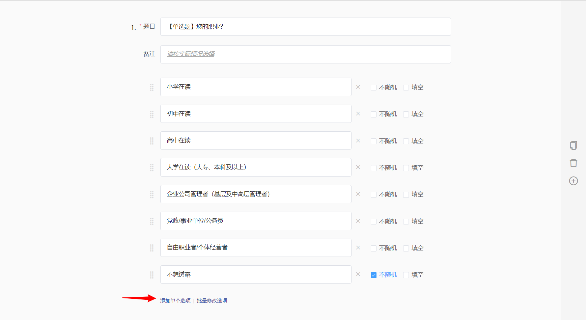
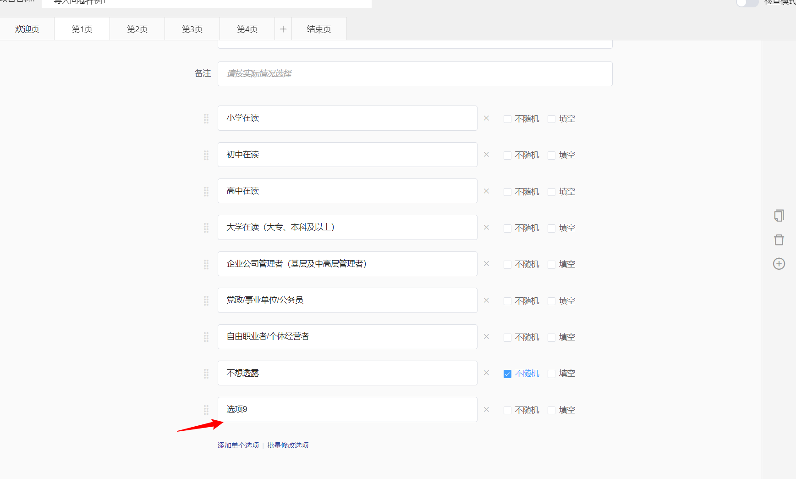
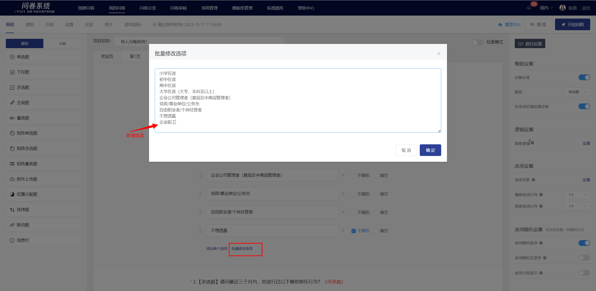
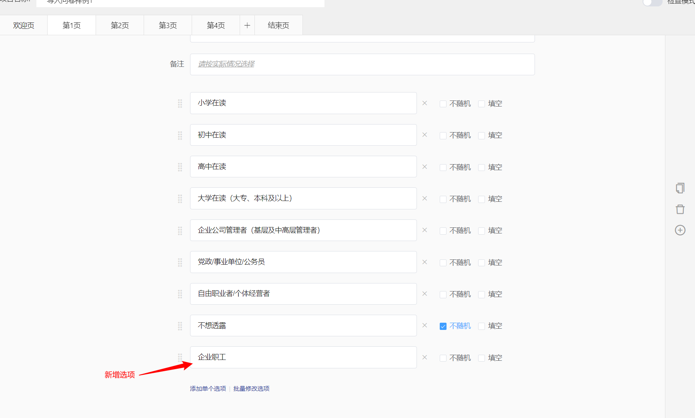
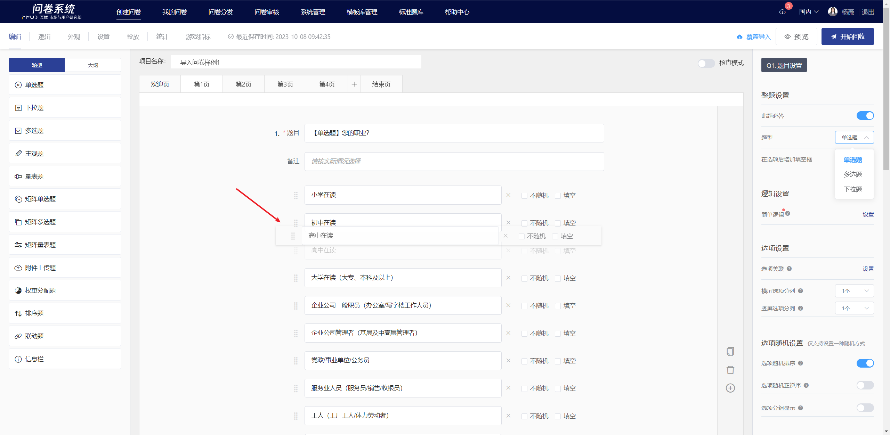

# Adding, Deleting, and Reordering Options

### Add option

There are two ways to add options: adding individually and adding in bulk.

### Add a single option

In the question editing state, clicking the "Add Single Option" button below will add a new option box below the last option.

### Bulk Add Options

In the question editing state, clicking the "Batch Edit Options" button below will display the batch edit options popup. You can directly add new options in the editing area, with each line representing one option. After clicking confirm, the options will be automatically generated in the option box in the editing state.

### Delete option

### Delete single option

Click the delete button next to the specified option to remove it.

.png>)

### Bulk Delete Options  &#x20;

Delete the row containing this option in the batch edit options popup

.png>)

### Reordering of options

### Drag and drop to reorder single-choice options

In the question editing state, you can adjust the order of options by long-pressing and dragging when the mouse is hovered over the left side of the option text box.

### Batch Adjust Option Order

In the bulk edit options dialog, adjust the order of options, with each line

.png>)

