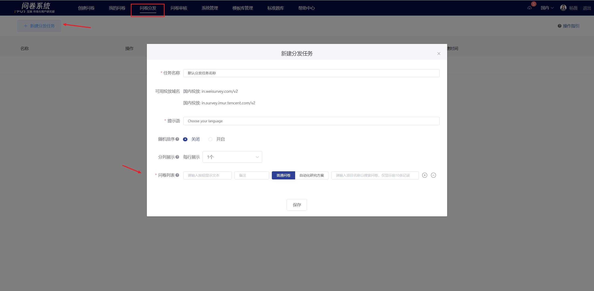
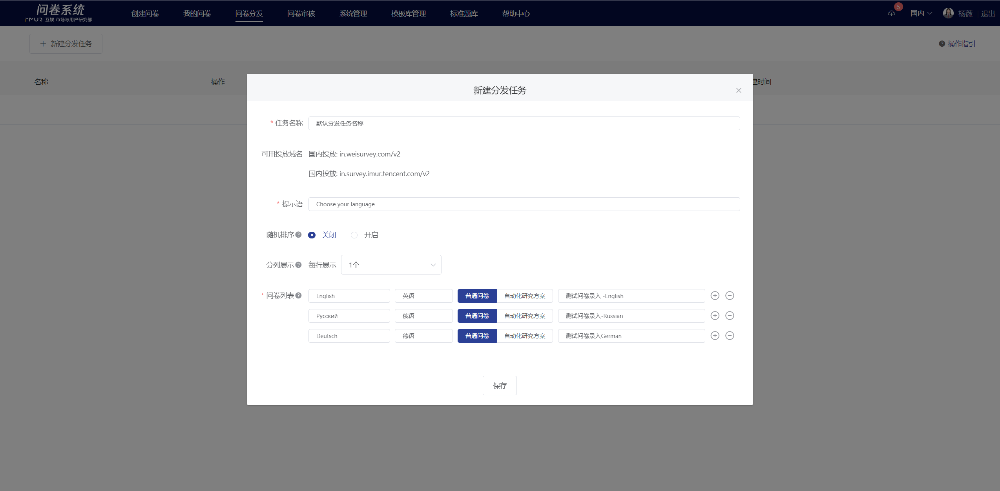
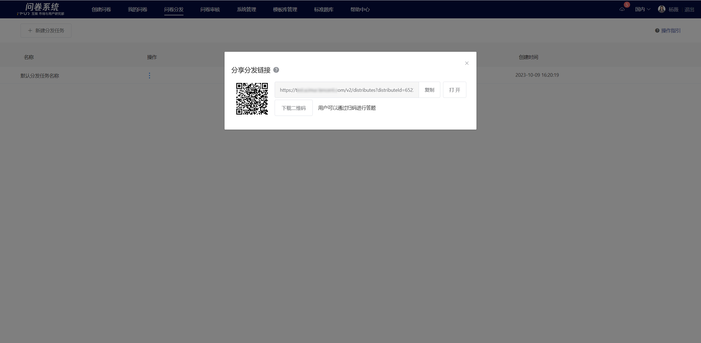
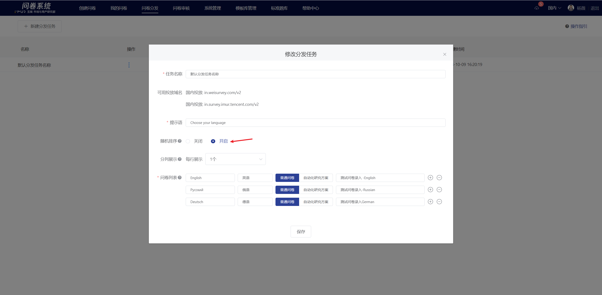
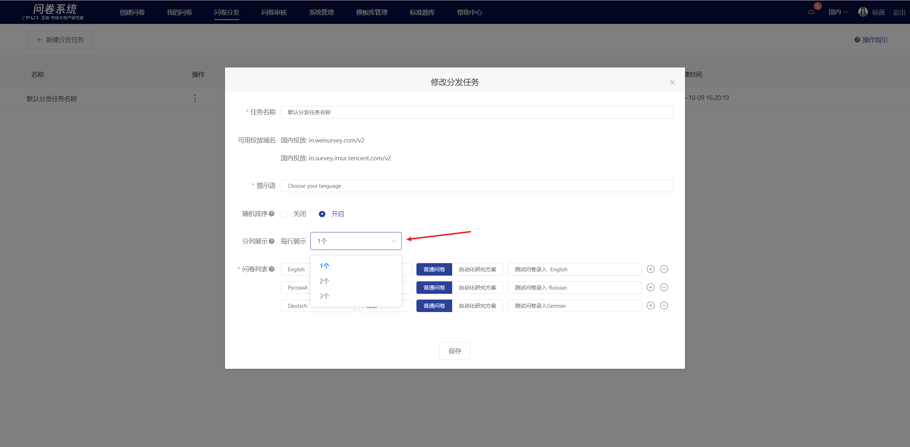

# Survey distribution

Survey distribution is mainly applicable to scenarios where the same survey needs to be distributed in multiple languages or versions, allowing respondents to choose and fill out different versions of the survey according to their actual situation. The response data for each survey is independently collected and analyzed.

The management end provides a configuration function for the survey distribution page, which is used to configure the text displayed on multiple buttons on the distribution page (summary page) and the survey that is redirected to after clicking the buttons. The distribution link of the distribution page is used for deployment.

.png>)

## Create a new distribution task

### 【STEP 1】Set the task name and prompt

In the "survey distribution" feature, click the "Create New Distribution Task" button in the upper left corner to display the new distribution task popup. Set the task name and prompt in the popup.

* Task Name: Only displayed in the survey system, not visible to respondents
* Prompt: Displayed within the survey page, generally used to guide respondents in selecting the survey.

### 【STEP 2】Configure display buttons with their corresponding surveys

The text content required for the button in the pop-up window, select the corresponding survey for the button. When the respondent clicks a button in the answering end, it will automatically jump to the corresponding survey. Multiple buttons can be configured.


* You can choose surveys created/followed by yourself, and support searching by entering the project name.
* The button provides system preset texts (in 19 languages) to choose from, and also supports input and editing.
* Remarks are only displayed in the survey system backend and are not shown to the respondents.


### 【STEP 3】Save and Deliver

After setting the task name, prompt, buttons, and corresponding survey, save to take effect. Obtain the distribution link from the operation menu for deployment, and multiple distribution domains can be used.


After deleting the distribution task, the distribution page becomes invalid, but it does not affect the distribution status or the collected data of each survey.


### Survey interface display

Respondents can navigate to the specified survey by clicking each button, and the response data collected from each survey is independent

.png>)

## 分发按钮随机排序

在配置分发任务时，支持设置分发按钮随机排序。功能开启后，答题者访问该分发页时，分发按钮按随机顺序展示，以保证在多套问卷投放的场景下样本量可平均分布。

.png>)

## 分发按钮分列展示

在配置分发任务时，支持设置分发按钮分列展示，设置成功后，在PC答题端/移动答题端横屏中会根据设置的每行展示按钮个数对按钮进行分列展示，可设置每行展示1\~3个。移动端竖屏不生效，适用于按钮数量多且按钮文本不长的情况。

.png>)
