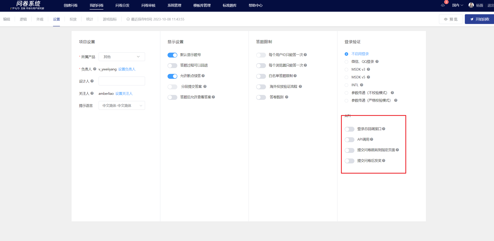
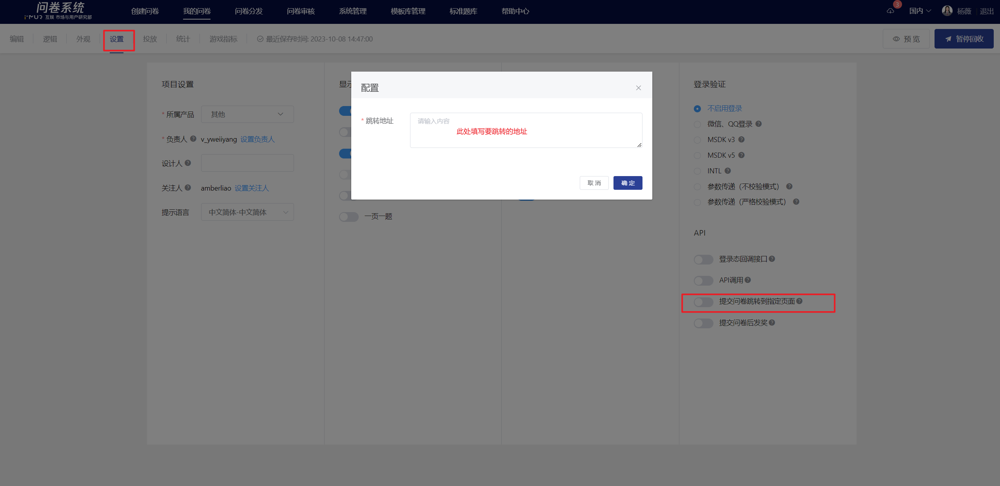
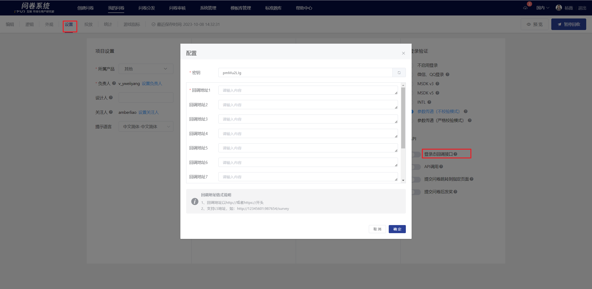
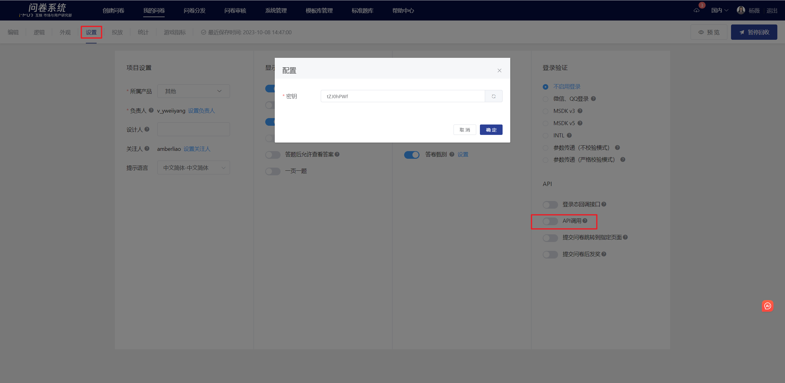
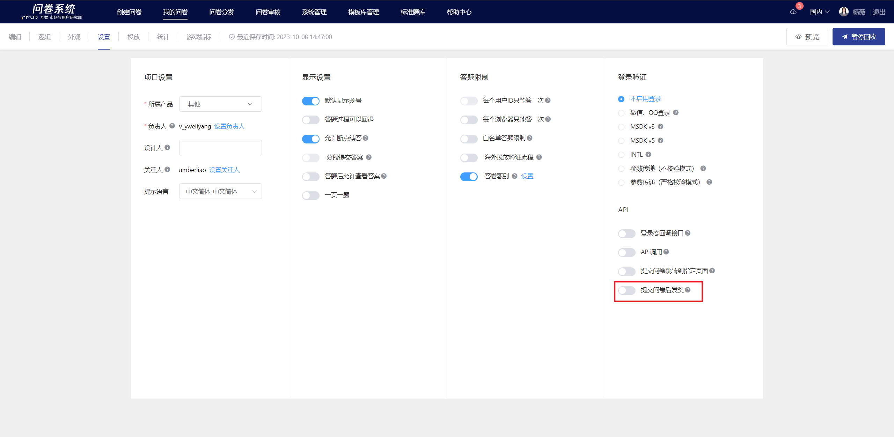
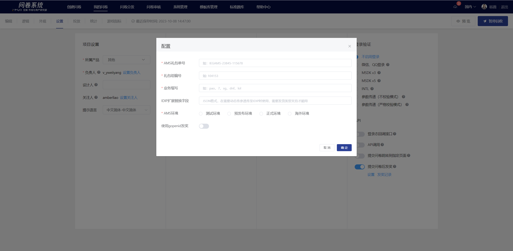

# API (redirection/callback/reward distribution)

The survey system supports embedded deployment, post-survey redirection, parameter callbacks, and other functions. Users can configure the settings according to their actual needs.

### Submitting the survey redirects to the specified page.

After enabling the feature, enter the redirect link in the settings popup (the link must be an address with the http:// or https:// prefix). Once the setup is complete, the browser will redirect to the link you set after the respondent submits the survey.

### Login state callback interface

Provide login state callback functionality, allowing developers to configure callback addresses and keys. The survey system will send login state and other parameters back to the developers, who can then use these parameters for reward distribution.

### The same survey supports setting multiple callback addresses.

When delivering, the client injects a callback parameter into the survey link to differentiate which callback address to return to after the submission. Up to 10 callback addresses can be configured, and the specific callback address is designated by the client.

Note: Each time a survey is submitted, it can only be called back to one address. If the survey link does not include the callback parameter, it will default to address 1.


If the value of callback injected in the link is 2, the system will automatically send the login status information to callback address 2 after submission.

https://in.weisurvey.com/?sid=5f87b81376051f331039dfe5\&openid={openid}**\&callback=2**


### Callback Example

Developer Callback Interfaceurl?sid=5da414769e8aa80019305e32\&timestamp=1573556685\&uid=test\_user\&user\_type=third\_party\&uid\_source=qq\&info=afdadsfasdfasdf\&callback\_params=callbackparams\&sign=38408d6222e1a4c6fa598e4820443ca8

[Click to view detailed API documentation.](broken-reference)

### API Call

The system provides an open interface for querying response information, answer statistics, question type statistics, etc., for a specified survey. Once the feature is enabled, the system will automatically generate a key (the key can be customized and modified). The key is used to call the interface to query survey information. If the feature is disabled, the query cannot be called.

[Click to view detailed API documentation](broken-reference)

### Rewards will be given after submitting the survey

The system supports awarding AMS gift packages, which can be achieved through the survey settings—awarding function after survey submission; for games that have integrated AMS email delivery function, when this function is enabled, the survey system can automatically trigger the reward distribution after the user submits the survey.


1. Only supports games with integrated email delivery functionality
2. The survey must be opened[MSDK登录验证](../../../cao-zuo-zhi-yin/wen-juan-she-zhi/da-ti-xian-zhi-she-zhi/#msdk-deng-lu-yan-zheng)/[参数传递（严格校验模式）](../../../cao-zuo-zhi-yin/wen-juan-she-zhi/chuan-can-tiao-zhuan-hui-tiao.md#can-shu-chuan-di-jie-kou-yan-ge-xiao-yan-mo-shi)/[参数传递（不校验模式）](../../../cao-zuo-zhi-yin/wen-juan-she-zhi/chuan-can-tiao-zhuan-hui-tiao.md#can-shu-chuan-di-jie-kou-bu-xiao-yan-mo-shi)Any of the above functions
3. Each respondent can only be awarded once; respondents who have already successfully received an award will not trigger the award again after completing the survey again.


### 【STEP 1】Bundle Configuration

lease configure the AMS gift package order in the AMS interface platform - Gift Package Warehouse (mrms), which is the item warehouse, to obtain the AMS gift package order number and gift package group number.


Note: For domestic use, please ensure the channel is configured as MUR survey reward application \[IEG-AMS-11836]&#x20;

The overseas usage channels must be configured as the MUR survey reward application \[IEG-AMS-4000046]


### 【STEP 2】Award Configuration

Enable the "Award after submitting the survey" feature in the survey that requires awarding, and configure the AMS gift package order number, gift package group number, business abbreviation, and AMS environment parameters.

If the game uses gopenid for rewards, then enable gopenid.

### 【STEP 3】Passing award parameters

The survey must enable MSDK login verification/parameter passing (strict verification mode)/parameter passing (non-verification mode) in any of the above functions. The game client should inject the following four reward parameters into the survey link through concatenation for the purpose of awarding prizes. The parameters are explained as follows:

| Parameter nam         | Explanation                                                                                     |
| --------------------- | ----------------------------------------------------------------------------------------------- |
| 

sPlatId
 | Platform type, such as iOS:0, Android:1                                                         |
| sArea                 | Corresponding to the channels, such as QQ and WeChat, please provide the corresponding numbers. |
| sPartition            | Mobile use, community                                                                           |
| sRoleId               |  Character ID, provided when shipped to in-game.                                                |

Survey link injection reward parameter example

| Situation                                            | Injection Instructions                                                                                         | Example link                                                                                                                                                                                                                                                                                                                                                                                                                                                                                                                                   |
| ---------------------------------------------------- | -------------------------------------------------------------------------------------------------------------- | ---------------------------------------------------------------------------------------------------------------------------------------------------------------------------------------------------------------------------------------------------------------------------------------------------------------------------------------------------------------------------------------------------------------------------------------------------------------------------------------------------------------------------------------------- |
| Original survey link                                 | --                                                                                                             | https://in.survey.imur.tencent.com/?sid=5e8d767b76051f46707cf692                                                                                                                                                                                                                                                                                                                                                                                                                                                                               |
| MSDK Login Verification                              | 
The 4 award parameters are directly appended to the survey link.

                                 | https://in.survey.imur.tencent.com/?sid=5e8d767b76051f46707cf69&#x32;**\&sPlatId={sPlatId}\&sArea={sArea}\&sPartition={sPartition}\&sRoleId={sRoleId}**                                                                                                                                                                                                                                                                                                                                                                                        |
| Parameter Passing Interface (No Verification Mode)   | The 4 award parameters are directly appended to the survey link.                                               | https://in.survey.imur.tencent.com/?sid=5e8d767b76051f46707cf692\&openid={答题者openid}**\&sPlatId={sPlatId}\&sArea={sArea}\&sPartition={sPartition}\&sRoleId={sRoleId}**                                                                                                                                                                                                                                                                                                                                                                         |
| Parameter Passing Interface (Strict Validation Mode) | Concatenate the four award parameters to the link assigned to redirect, and then encode the value of redirect. | 
https:// inapi.survey.imur.tencent.com/autologin?sid

=5e8d767b76051f46707cf692&#x26;uid=user_id&#x26;timestamp=1573455797

&#x26;source=dwk&#x26;info=extra_info&#x26;redirect=https%3A%2F%2F

in.survey.imur.tencent.com%2F%3Fsid%3D5e8d767b76051f46707cf692

%26lang%3Dzh-CHS%26ADTAG%3Dsid.5e8d767b76051f46707cf692

<strong>%26sPlatId%3D{sPlatId}%26sArea%3D{sArea}%26sPartition</strong>

<strong>%3D{sPartition}%26sRoleId%3D{sRoleId}</strong>

&#x26;sign=2ac5ab8ce6a9b306e07dc2664fe7d175
 |

### 【STEP 4】Interface Application

The AMS award triggered by the survey requires prior application for the in-game lottery interface. Please contact via WeChat Work: IMUR Survey System Assistant.

### 【STEP 5】Complete

In the game, when a survey is deployed and respondents submit the survey, the survey system will automatically trigger the AMS gift package single reward (the prize name will be displayed as the gift package group name configured in step 1).

<figure><figcaption>
Rewards will be given after completing the survey in the game.
</figcaption></figure>

Award Record Inquiry

Click "Award Records" to view the award triggering status of all quiz accounts.。

<figure><figcaption>
Check prize records
</figcaption></figure>

<figure><figcaption>
Award Record Details
</figcaption></figure>

AMS Response Code Description

<table><thead><tr><th width="136">AMS Response Code Description</th><th width="198.33333333333331">Situation Report</th><th>Recommended Actions</th></tr></thead><tbody><tr><td>0</td><td>Award granted successfully</td><td>/</td></tr><tr><td>Empty or -100</td><td>Not a test number</td><td>To call the gift package interface in the test environment, you need to use a test account. Please register, bind, and associate the openid in the test account system first.</td></tr><tr><td>100002</td><td>The package depletion requires rollback eligibility</td><td>Go to the gift pack warehouse to adjust the configuration of the gift packs, allowing each account to claim multiple times or increasing the total number of gift packs.</td></tr><tr><td>-9012</td><td>Abnormal parameters such as server region</td><td>It is necessary to confirm whether the values of the four parameters sPlatId, sArea, sPartition, and sRoleId are correct.</td></tr><tr><td>-9081</td><td>Calling the gopenid interface did not return a valid gopeni</td><td>

<ol><li>Use the openid system in the game: Turn off the "Use gopenid for rewards settings" in the settings popup.</li><li>Using the gopenid system in the game: If the user has not registered a game character or there is an exception with the gopenid service, check the account status.</li></ol></td></tr></tbody></table>

