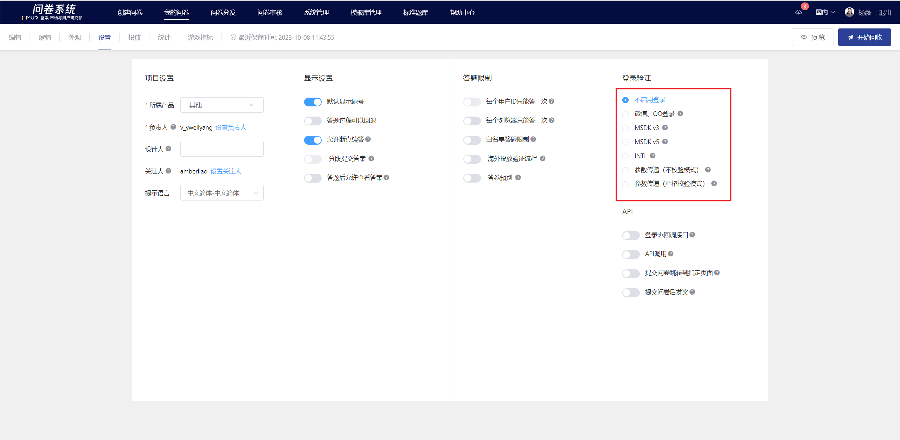
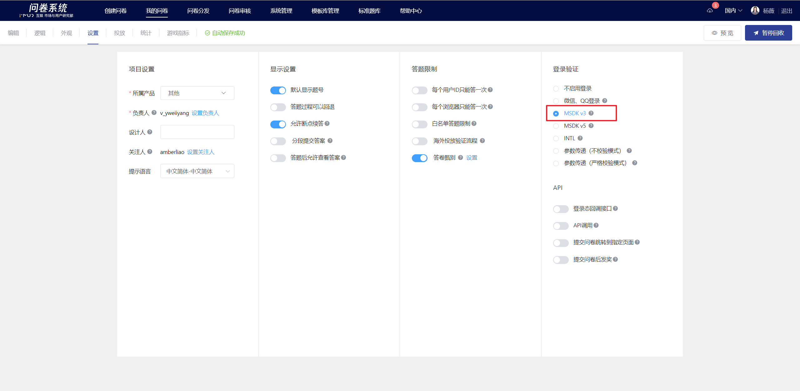
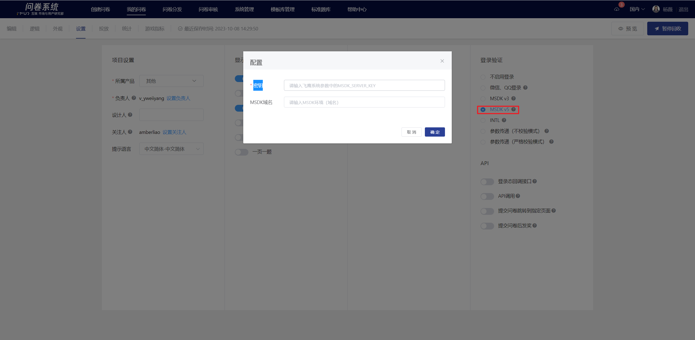
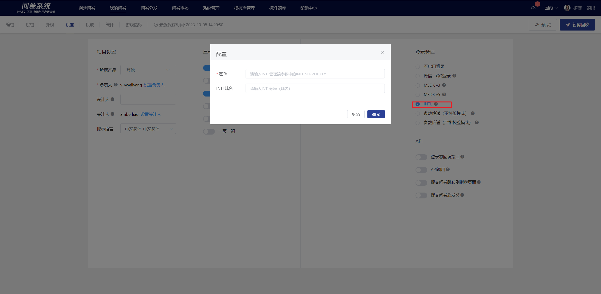
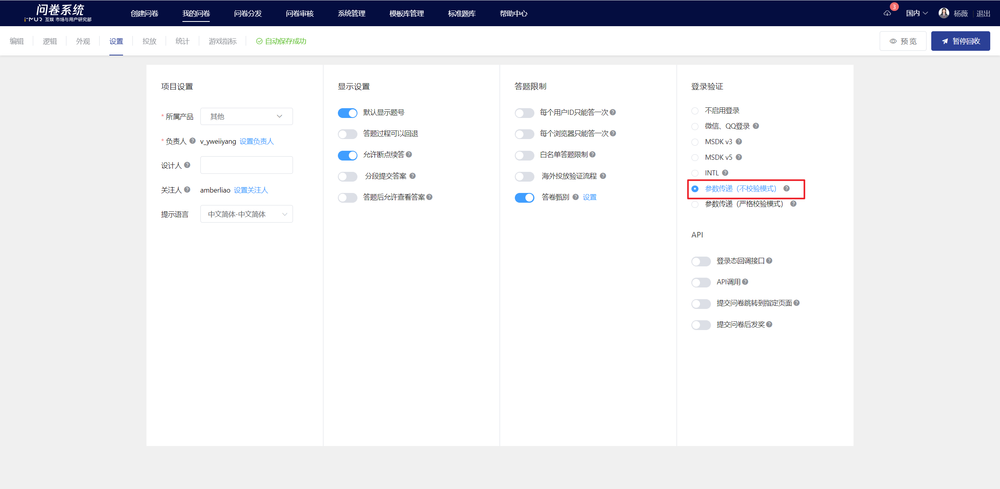
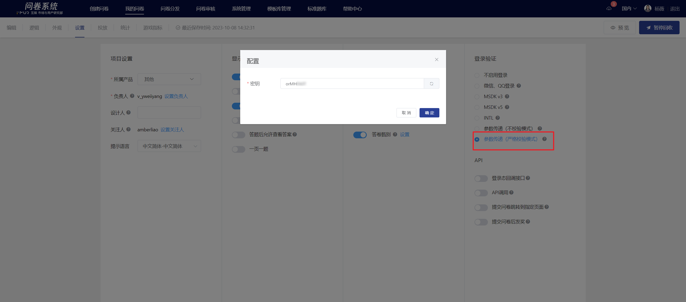

# Survey Login Verification

The survey system supports collecting different types of login status information (openid). Survey designers can follow the process below to enable the corresponding functions. Some features require developers to integrate with the system's

.png>)

### WeChat, QQ login

Once the feature is enabled, the survey system will automatically prompt QQ/WeChat login. Users will be allowed to answer the survey only after logging in. The survey system will collect the user's uid and record and display it in the survey data.

## MSDK v3

After the feature is enabled, when deploying within games integrated with MSDK v3, the survey system can obtain the openid of logged-in users and store it in the user id column, displaying it in the survey data.

## MSDK v5&#x20;

After the feature is enabled, when deploying within games integrated with MSDK v5, the survey system can obtain the openid of logged-in users and store it in the user id column, displaying it in the survey data.

### Parameter Configuration Instructions


Please fill in the "Key" with the MSDK\_SERVER\_KEY from the Falcon system parameters.

Please fill in the "Key" with the MSDK\_SERVER\_KEY from the Falcon system parameters.


| Environment (Domain)              | HTTP Intranet                        | HTTPS external network                                                                       |
| --------------------------------- | ------------------------------------ | -------------------------------------------------------------------------------------------- |
| Test Environment                  | http://hktest.itop.tencent-cloud.net | 
https://hktest.itop.qq.com （Domestic）

https://ipv6-hktest.itop.qq.com（Overseas）
 |
| Domestic Production Environment   | http://itop.tencent-cloud.net        | 
https://itop.qq.com

https://ipv6-sh.itop.qq.com
                                 |
| Singapore's official environment  | None                                 | https://sg.itopsdk.com                                                                       |
| Silicon Valley formal environment | None                                 | https://us.itopsdk.com                                                                       |

### INTL Login Authentication

After the feature is enabled, when the survey system is deployed in games that have integrated INTL, it can obtain the openid of logged-in users and store it in the user id column, which will be displayed in the survey data.

### Parameter Configuration Instructions


Please fill in the "Key" with the INTL\_SERVER\_KEY from the INTL management parameters.

The "domain name" distinguishes between the production environment and the testing environment. Please refer to the following for filling it out:[INTL域名](https://developers.intlgame.com/docs/intlsdk/JS/JSOverview#Environment)


### Parameter Passing (No Validation Mode)

For apps not integrated with msdk, when embedding the survey, the survey system collects the user's uid through the login state passed by the developer. After enabling the no-verification mode, player information and other parameters can be passed to the survey system by directly appending parameters to the survey link.


1. The no-verification mode does not perform signature verification, which may pose a risk of being exploited.
2. For surveys with verification disabled, the survey cannot be opened if the openid parameter is not correctly appended.



\[Embedded Placement Link]

https://in.survey.imur.tencent.com/?sid=5e8d767b76051f46707cf692\&lang=zh-CHS\&ADTAG=sid.5e8d767b76051f46707cf692\&openid=XXXX\&source=XXXX\&info=XXXX


Click“[参数传递接口（不校验模式）](../../../api-wen-dang/can-shu-chuan-di-jie-kou-bu-xiao-yan-mo-shi.md)” API documentation to learn how to modify the survey link.

### Parameter Passing (Strict Validation Mode)

For apps that are not integrated with msdk, when embedding a survey, the survey system collects the user's UID by passing the login state through the developer. After enabling the feature, a pop-up window will display a key, which is used to generate a signature (the key can be modified or regenerated). Click confirm to close the pop-up window.


\[Embedded Placement Link]

https://inapi.survey.imur.tencent.com/autologin?sid=5e8d767b76051f46707cf692\&uid=user\_id\&timestamp=1573455797\&source=dwk\&info=extra\_info\&redirect=https%3A%2F%2Fin.survey.imur.tencent.com%2F%3Fsid%5e8d767b76051f46707cf692%26lang%3Dzh-CHS%26ADTAG%3Dsid.5e8d767b76051f46707cf692\&sign=2ac5ab8ce6a9b306e07dc2664fe7d175


Click“[参数传递接口（严格校验）](../../../api-wen-dang/fei-msdk-deng-lu-tai-chuan-di-jie-kou.md)”API documentation to learn how to modify the survey link.
