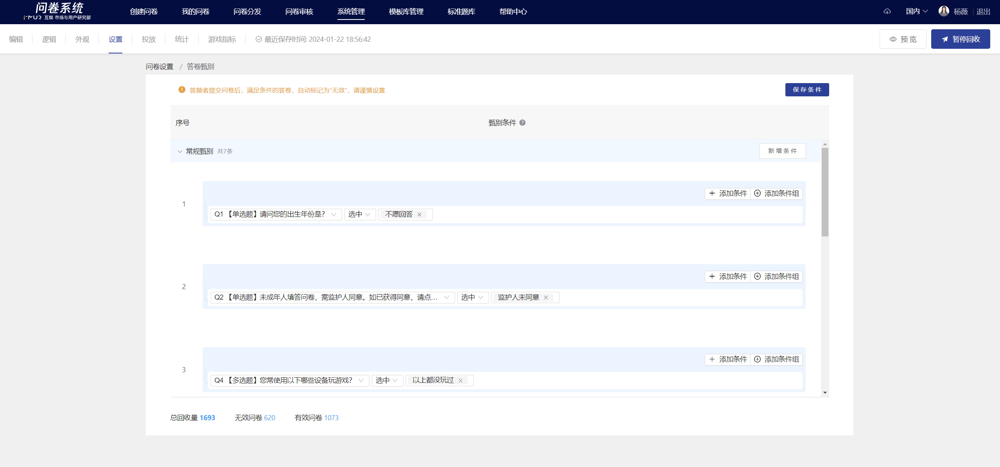
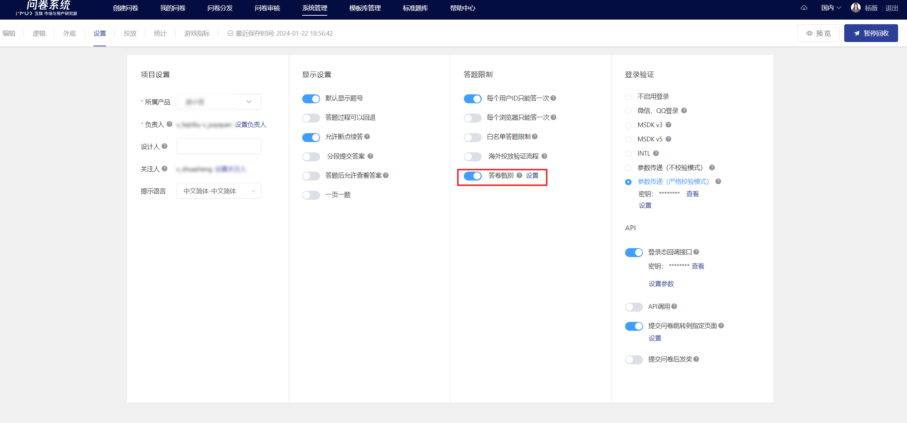
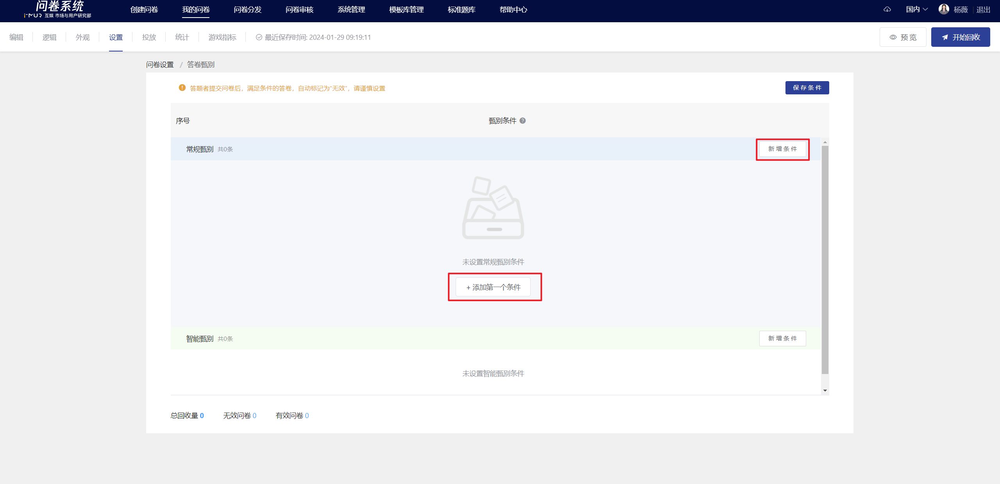
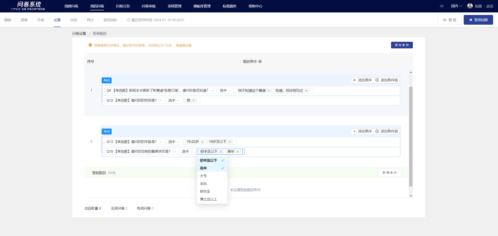

# 答卷甄别

系统提供答卷甄别功能，适用场景：玩家提交后系统自动按指定条件把不符合要求的样本剔除，[在线查看答题数据](../../../../cao-zuo-zhi-yin/tong-ji-fen-xi/da-ti-shu-ju-zai-xian-cha-kan.md)/[导出数据](../../../../cao-zuo-zhi-yin/xia-zai-shu-ju/)中，不合格样本被标记为无效。

<figure><figcaption>
答卷甄别
</figcaption></figure>


**特殊说明**

1、设置甄别条件必须在**投放前**，投放前务必确认所设置的甄别条件无误。

2、如投放过程中修改甄别条件，新回收部分的数据将按照新调整的甄别条件过滤，已回收部分的数据不会改变


## 【STEP 1】设置条件

在“设置”-“答题限制”中，启用“答卷甄别”设置入口。

<figure><figcaption>
功能入口
</figcaption></figure>

进入页面后，点击右上角“新增条件”或“”添加第一个条件”即可创建一条新的甄别条件。

### 创建甄别条件

<figure><figcaption>
创建甄别条件
</figcaption></figure>

### 设置条件及规则的and、or关系

<figure><figcaption></figcaption></figure>


**操作提示**

在选择选项时，如需连续n个，在下拉列表中：点选首个选项->按住shift->点选末个选项，松开shift，即可实现连选


<figure><figcaption>
设置条件（组）之间的and、or关系
</figcaption></figure>


**操作提示**

支持用条件/条件组来设置复杂表达式的清洗规则，可实现条件之间的嵌套

【例】需要清洗掉关于“沙盒游戏时间”前后说法不一致的答题记录：

Q9沙盒类的游戏时间 选中 小于5小时&#x20;

**and**&#x20;

（Q10.1 A类的沙盒游戏时间 选中 5小时以上的选项 **or** Q10.2 B类的沙盒游戏时间 选中 5小时以上的选项 **or** Q10.3 C类的沙盒游戏时间 选中 5小时以上的选项 **or** Q10.4 D类的沙盒游戏时间 选中 5小时以上的选项）



.png>)

## 【STEP 2】保存

设置完所有条件后，点击右上角“保存条件”，完成。

<figure><figcaption></figcaption></figure>

## 【STEP 3】查看数据

开始回收后，页面会显示被过滤掉的无效答卷总数。

<figure><figcaption></figcaption></figure>

前往[在线查看答题数据](../../../../cao-zuo-zhi-yin/tong-ji-fen-xi/da-ti-shu-ju-zai-xian-cha-kan.md) 或 [导出数据](../../../../cao-zuo-zhi-yin/xia-zai-shu-ju/)，可查看被过滤的答题记录。

<figure><figcaption></figcaption></figure>
