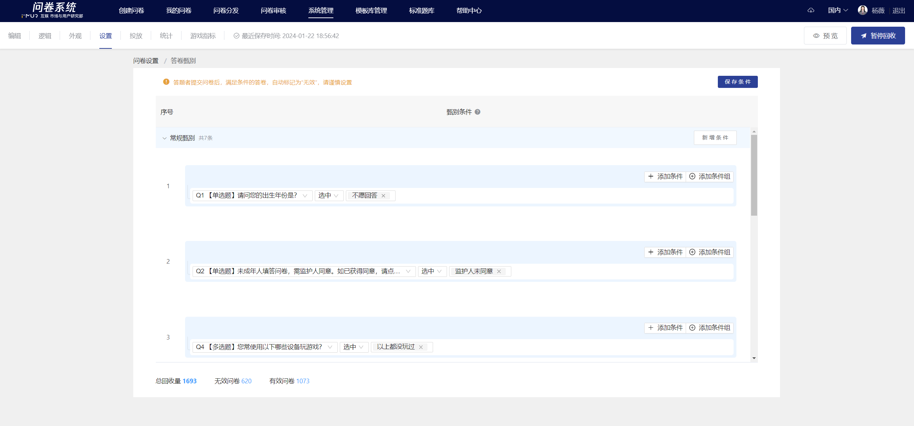
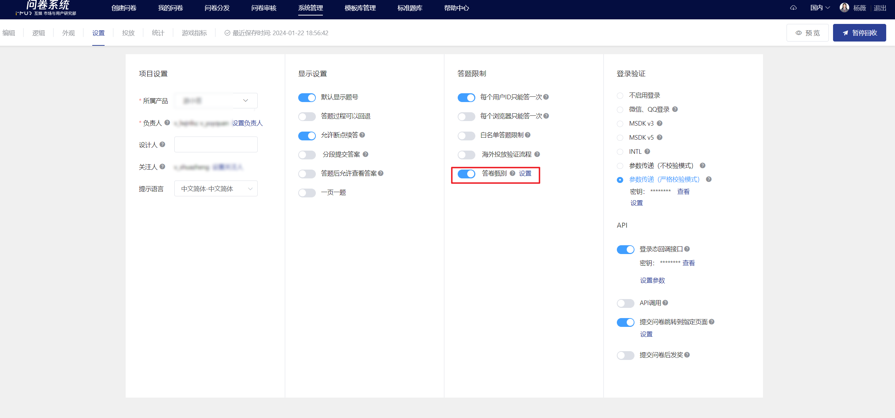
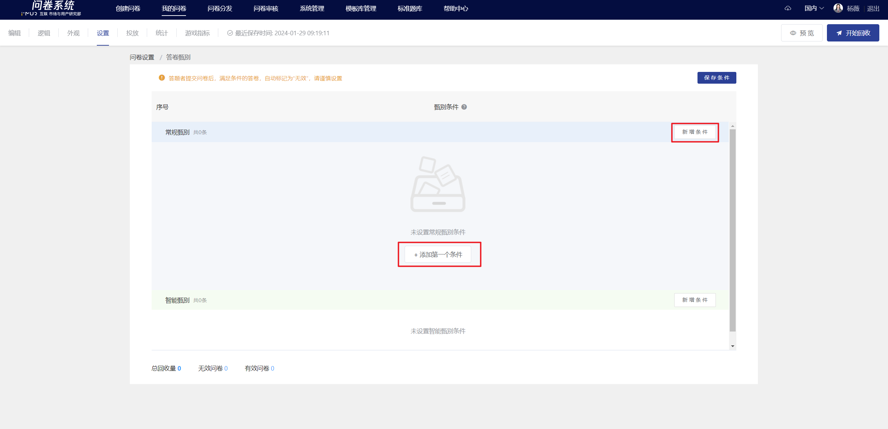

# Survey Screening

The system provides a survey screening function, applicable scenarios: After players submit, the system automatically excludes samples that do not meet the specified conditions. In the online answer data view/export data, unqualified samples are marked as invalid.

<figure><figcaption>
Survey Screening
</figcaption></figure>


Special Instructions

1. The screening criteria must be set before the survey is launched, and it is essential to confirm that the set screening criteria are correct before launching.
2. If the screening criteria are modified during the survey distribution process, the newly collected data will be filtered according to the newly adjusted screening criteria, while the already collected data will remain unchanged.


## 【STEP 1】Set Conditions

In "Settings" - "Response Restrictions", enable the "Survey Screening" setting entry.

<figure><figcaption>
Function Entry
</figcaption></figure>

After entering the page, click on "Add New Condition" in the upper right corner or "Add First Condition" to create a new screening condition.

### Create screening criteria

<figure><figcaption>
Create screening criteria
</figcaption></figure>

The "and" and "or" relationships for setting conditions and rules

<figure><figcaption></figcaption></figure>


**Operation Tips**

When selecting options, if you need to select multiple consecutive options, follow these steps in the dropdown list: click the first option -> hold down the shift key -> click the last option -> release the shift key to complete the selection.


<figure><figcaption>
and, or between conditions (groups)
</figcaption></figure>

\*\*Operation Tip\*\*

You can use conditions/groups to set complex expressions for data cleaning rules, including nested conditions.

**Example:** To clean responses with inconsistent statements about "sandbox game time":

Q9 Sandbox game time selected less than 5 hours

**and**

(Q10.1 A-type sandbox game time selected more than 5 hours **or** Q10.2 B-type sandbox game time selected more than 5 hours **or** Q10.3 C-type sandbox game time selected more than 5 hours **or** Q10.4 D-type sandbox game time selected more than 5 hours)

![\[Example\] Complex Condition -- Nested Condition](<../../../../.gitbook/assets/image (81).png>)

## 【STEP] Save

After setting all the conditions, click "Save Conditions" at the top right corner to complete.

<figure><figcaption></figcaption></figure>

## 【STEP 3】View data

Once the collection starts, the page will show the total number of invalid

<figure><figcaption></figcaption></figure>

Go to the[在线查看答题数据](../../../../cao-zuo-zhi-yin/tong-ji-fen-xi/da-ti-shu-ju-zai-xian-cha-kan.md) or [导出数据](../../../../cao-zuo-zhi-yin/xia-zai-shu-ju/)，filtered survey responses can be viewed

<figure><figcaption></figcaption></figure>
