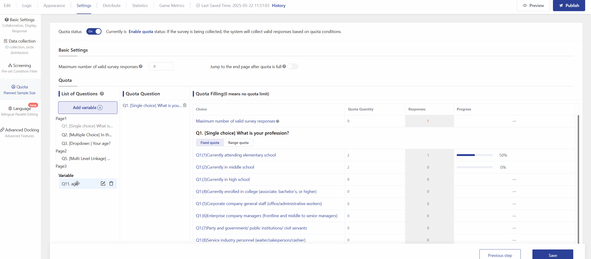

# Quota Settings

Quota settings only support single-choice , multiple-choice , and multi level linkage (requires address import)

### 【STEP 1】Choose single-channel or multi-channel distribute

For regular distribution, simply choose single-channel distribut(if you need to allocate quotas for multiple sub-links separately, you can choose multi-channel distribute）

<figure><figcaption></figcaption></figure>

### 【STEP 2】Set Quota Question

Drag the items from the list on the left to the quota items on the right to create quota conditions.

<figure><figcaption></figcaption></figure>

### 【STEP 3】Set quota quantity

Set the quota for each  choice with the default of 0 meaning no quota limit.

<figure><figcaption></figcaption></figure>

### 【STEP 4】Turn on quota&#x20;

Before distributing the survey, please turn on the quota , otherwise the quota conditions will not be effective.

<figure><figcaption></figcaption></figure>

### 【STEP5】Check quota progress

You can access the quota settings page at any time during the  distribute to check the quota progress.

<figure><figcaption></figcaption></figure>

#### Set cross quotas 

By setting cross quotas, you can limit the number of times options can be selected based on 2 questions. For example, if you need to collect 10 surveys from male players who like computer games, you can use cross quotas to accomplish this. Set it as shown in the figure below by dragging the questions from the list to the questions that need to participate in the cross quotas.

<figure><figcaption></figcaption></figure>

### Maximum number of valid survey responses

When the number of valid surveys collected reaches the limit, the survey will automatically pause collection. The limit for valid surveys collected is 50,000.

<figure><figcaption></figcaption></figure>



1. The two entries above have the same function. The upper one is commonly used for setting a single survey collection limit without setting any quota questions; the lower one is suitable for setting a survey collection limit while setting quotas for the questions.
2. A maximum limit for valid survey recovery can be set for each distribution channel. Once the limit is reached, the channel will automatically pause recovery, while other channels will continue to recover surveys normally.



### Advanced Features


\
Range quota


When conducting quantitative collection of some samples, certain users allow the collected samples to fluctuate within a certain range. For example, when collecting questions for males and females, the male ratio can be allowed to fluctuate between 80%-90% and the female ratio between 10%-20%. In this case, interval quotas can be used for control.

<figure><figcaption></figcaption></figure>


1. When using range quota, a limit for each question must be set. Once the limit for a question is reached, any choice selected for that question will be marked as having an invalid quota.
2. If the limit for a single question is not reached, when an choice reaches the maximum value of the range, selecting that choice will be marked as an invalid quota.
3. Interval quotas only apply to single-choice  in single-channel distribute.



#### Jump to the end page after quota is full

When the answerer clicks "next page", the system will determine whether the full quota of choices has been selected. If the quota is full, the system will automatically redirect to the end page without the need to complete all the questions.

<figure><figcaption></figcaption></figure>

#### Add variable 

Support custom variables, i.e., recombine question fields to generate new variables. The newly generated variables can participate in quotas or generate cross-quotas with other questions.

<figure><figcaption></figcaption></figure>

<figure><figcaption></figcaption></figure>

After successfully adding, a new variable question will be generated below the question list, and you can drag it to participate in the quota.

<figure><figcaption></figcaption></figure>
