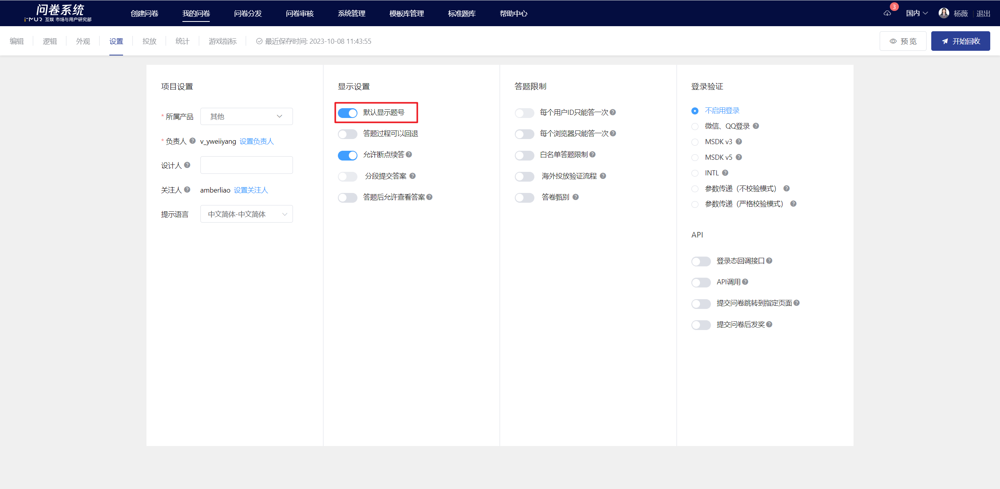
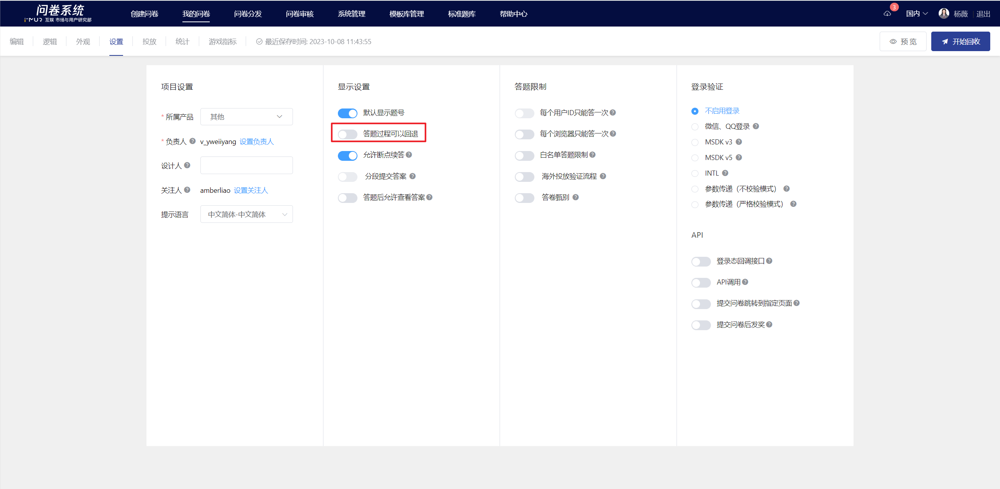
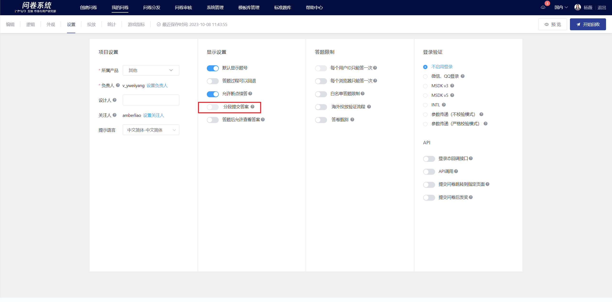
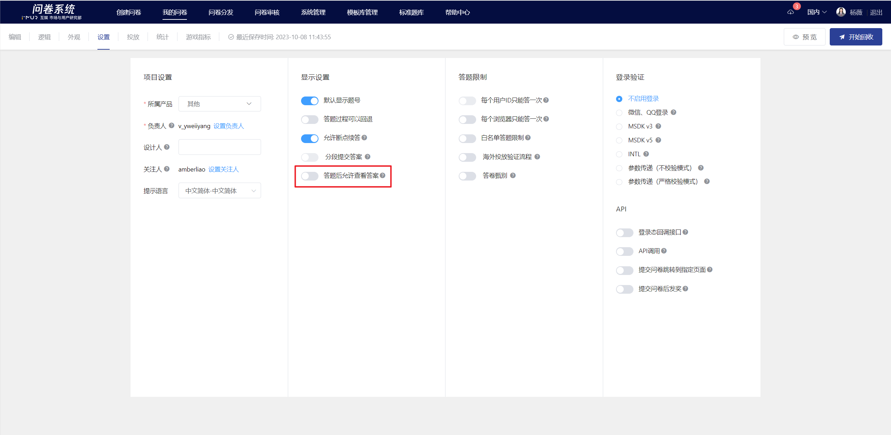
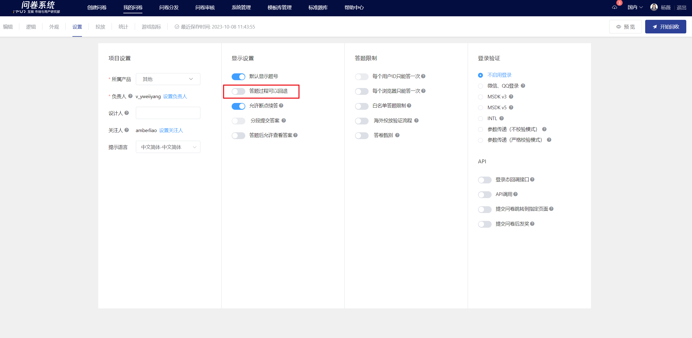

# Display Settings

In the "Display Settings" section of the "Survey Settings," you can configure the display of the response interface based on actual needs.

## Show question number

This feature is enabled by default. When turned off, the survey interface will not display question numbers.

.png>)

.png>)

## Answer Retraction

The ability to go back during the answering process means displaying a back button for the previous page on the answering end. This feature is turned off by default, so the back button for the previous page is not displayed on the answering end. Once enabled, a back button for the previous page will be added at the bottom of the page.

.png>)

.png>)

### Resume from breakpoint

The survey provides a local answer caching mechanism. When this feature is enabled, if the respondent exits midway through the survey, they can choose to continue answering or start over when they revisit the survey.

.png>)

### Submit answers in sections

After enabling, you can set to submit completed answers after a specified page. This feature needs to be used in conjunction with enabling "login verification" or "whitelist survey restriction".

<figure><figcaption></figcaption></figure>

### View answers after completing the survey

After respondents submit the survey, they can choose to review their responses; alternatively, logged-in users can reopen the survey to view their submitted answers after submission. This is suitable for scenarios where offline interviews require follow-up questions or discussions based on the survey answers.

.png>)

.png>)

### Answer watermark

You can set the user ID or custom content as a watermark for the survey. It will be displayed on the page when respondents answer to prevent information leakage.


Only by enabling login verification can the user ID be used as a survey watermark.


<figure><figcaption>
Set Watermark Entry
</figcaption></figure>

<figure><figcaption>
Custom watermark
</figcaption></figure>

Display effect of the survey interface

<figure><figcaption></figcaption></figure>

### Frequently Asked Questions

### 为什么答题时没有出现上一页按钮？

By default, respondents cannot go back (the previous page button is not displayed). If you want to allow respondents to go back, please enable the "Respondents can go back" function in "Survey Settings" - "Display Settings".

