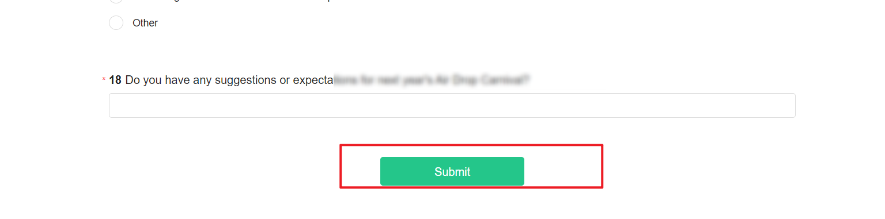

# Project Settings

In the "settings" under "Basic Settings," you can complete the project information, including the  product, survey owner, surveycollaborators , survey creator, and prompt language.etc

<figure><figcaption></figcaption></figure>


1. Before the survey is first collected/submitted for review, the information of the  product and the owner needs to be completed.
2. The owner, please fill in the user research manager for project coordination
3. After the UX research manager creates a survey, they automatically become the survey owner.


Head of Settings

The owner, also known as the other administrators of this survey, has the highest authority over the survey. The survey appears in their "My Surveys" list, enabling collaborative editing and management of the survey.

On the "Settings" page, you can designate the owner of a specific survey. After entering the user's RTX account or name in the input box, it will automatically search for matching users. Once selected, the person in charge will be successfully set.

<figure><figcaption></figcaption></figure>

### Set  collaborators

The  collaborators  is the regular user of this survey, supporting the assignment of specific permissions to the focus person. This survey will appear in their "My Surveys" list, enabling collaborative editing and management of the survey.


1. Only the survey owner can add  collaborators and assign permissions to them.
2. To avoid sensitive data leakage, please be cautious when assigning "survey data" and "export data" permissions.


<figure><figcaption></figcaption></figure>

### Prompt language

The prompt language refers to the language used for prompts displayed on the answering interface. The default is Simplified Chinese, but other languages can be set according to actual needs.

<figure><figcaption></figcaption></figure>

Supported Languages:

* Simplified Chinese - 中文简体
* Traditional Chinese - 中文繁體
* English - English
* Arabic - العربية
* German - Deutsch
* Russian - Pусский
* French - Français
* Filipino - Filipino
* Korean - 한국어
* Khmer - ខ្មែរ
* Malay - Bahasa Melayu
* Bengali - বাংলা
* Portuguese - Português
* Japanese - 日本語
* Thai - ภาษาไทย
* Turkish - Türkçe
* Urdu - اردو‎
* Spanish - Español
* Italian - Italiano
* Hindi - हिन्दी
* Indonesian - Bahasa Indonesia
* Vietnamese - Tiếng Việt \{%

<figure><figcaption></figcaption></figure>

<figure><figcaption></figcaption></figure>
