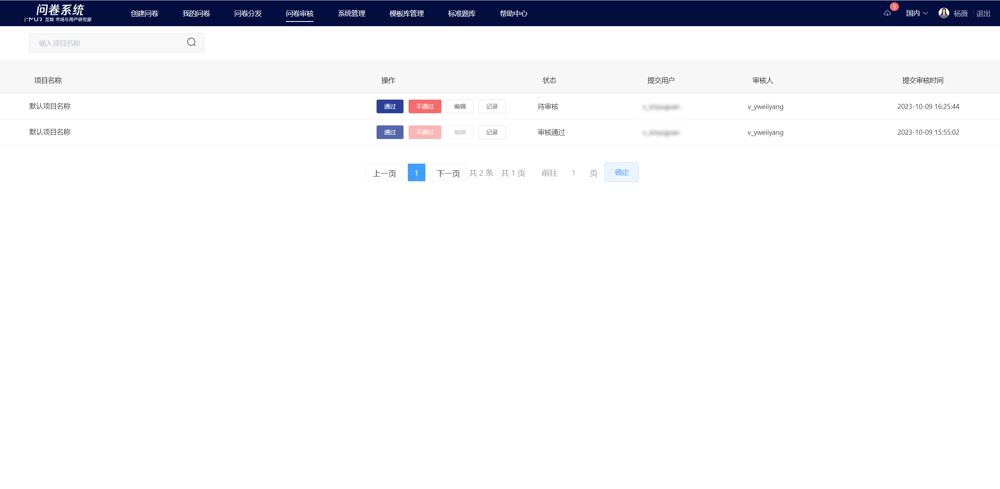
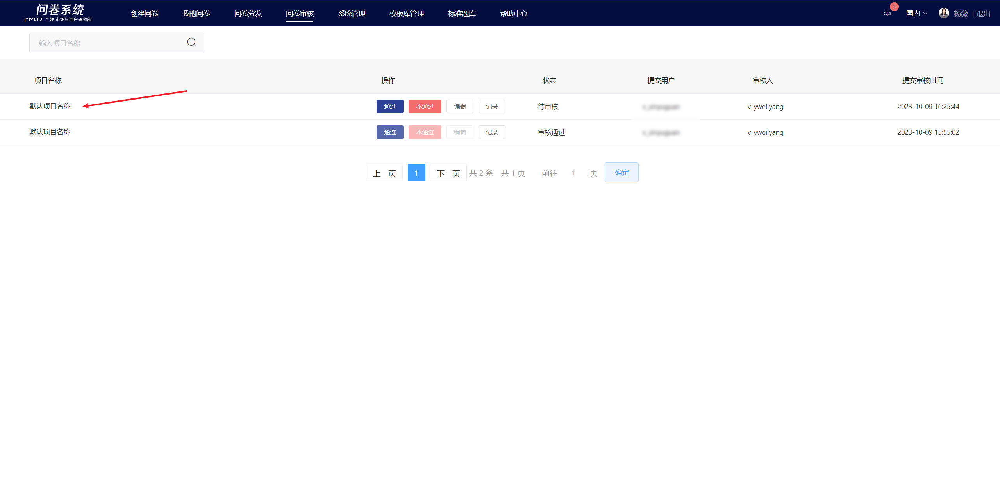
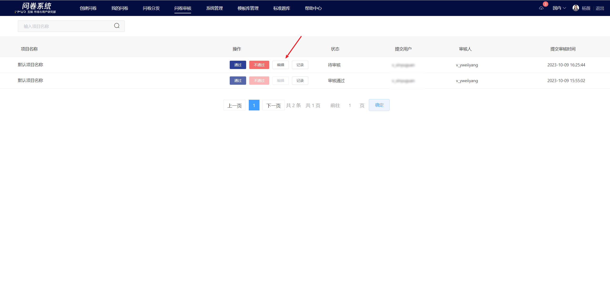

# Survey Review

To avoid risks and ensure the security of project information, regular users need to submit the survey to a designated reviewer for review before distributing it. Once the reviewer approves the survey, the distribution link becomes effective automatically, and the response data can be collected normally.

## List Management

&#x20;The "survey review" list displays all the surveys that need to be reviewed or have been reviewed by the user (as the reviewer). The survey list is sorted in descending order of "submission review time".

## Survey Preview&#x20;

In the "survey review" list, click the project name of the specified survey to enter the preview page of that survey.

## Review Status&#x20;

There are three review statuses: Pending Review, Approved, Not Approved, and Revoked. Only surveys with a status of Pending Review can be operated on.

## Survey Editor

The reviewer can edit the survey under review. After editing and approving, the distribution link of the survey will switch to public status.

### Audit Records

Click the "Record" button to view the review records of the survey, including each review result and information about the reviewer.

.png>)
