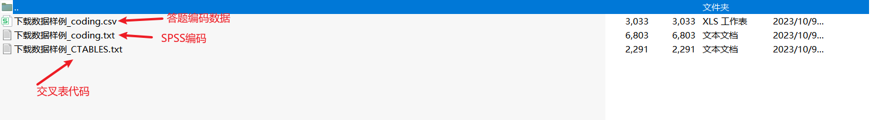

# Export survey code

In the "My Surveys" list, select a survey and click "Export" in the action bar to export the answer codes. This will export all the answer data for that survey.

<figure><figcaption></figcaption></figure>

&#x20;The file is downloaded asynchronously, and the export status of the task is displayed in the "Offline Download" pop-up window. You can download it after the export is complete.

<figure><figcaption></figcaption></figure>

The exported answer coding data is a .zip format compressed file, containing answer coding data (.csv), SPSS coding (.txt), and cross-tabulation code (.txt).


**Special Instructions**

Due to compliance restrictions, base domestic users cannot access personal privacy information such as player IDs. The survey system anonymizes the IP addresses and user ID columns in the exported data. If you need to obtain plain text data, please contact your overseas colleagues at base and request the survey system assistant to grant access before downloading. The downloaded data must be anonymized before being sent back to the domestic base. An example of the data is as follows:



