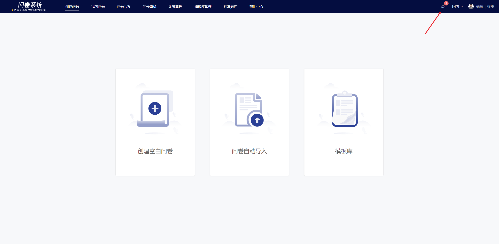
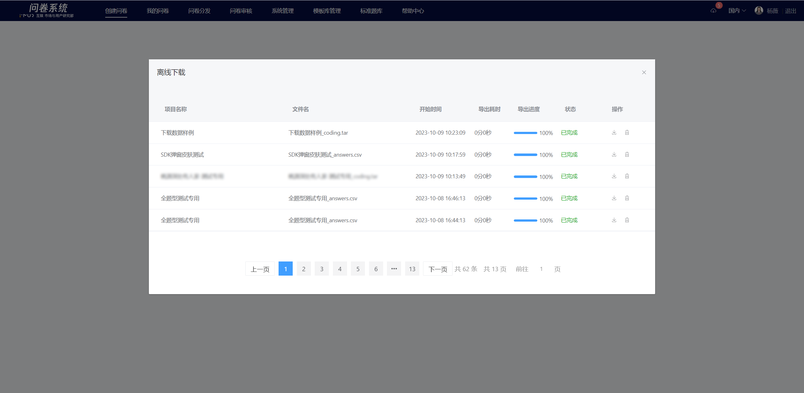

# Offline Download

To improve file export efficiency, the survey system uses an asynchronous file download method, which means exporting the file first and then downloading it locally. When exporting response code data and raw data, after the export is complete, you need to download the corresponding file from the "Offline Download" feature in the top toolbar.


The exported files are stored in the cloud, and users have the option to delete them themselves.


