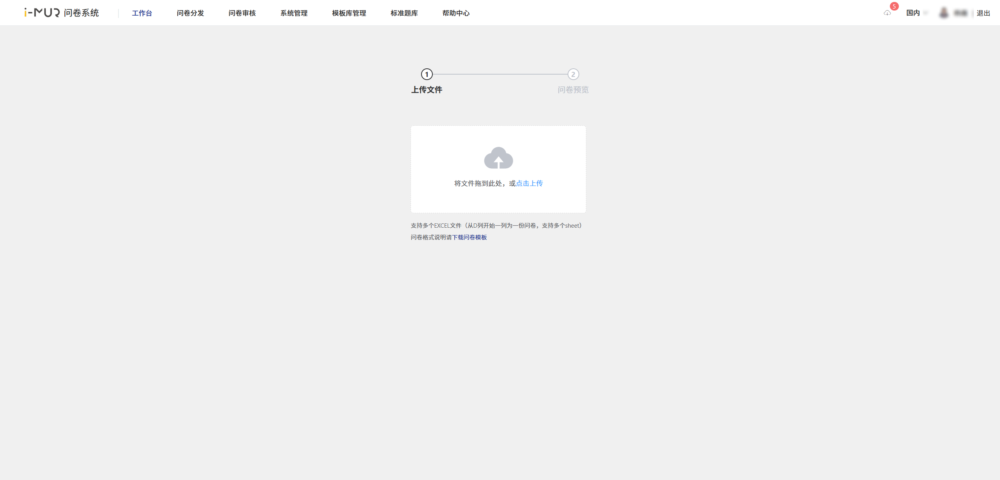
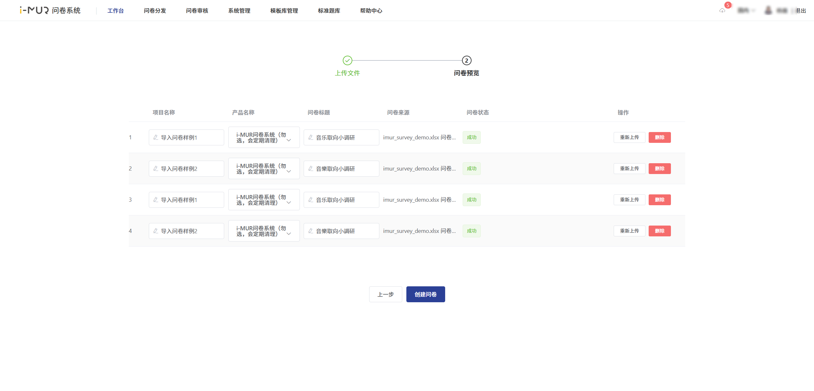
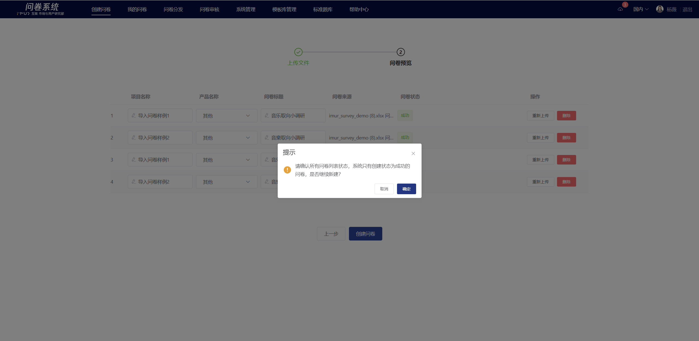
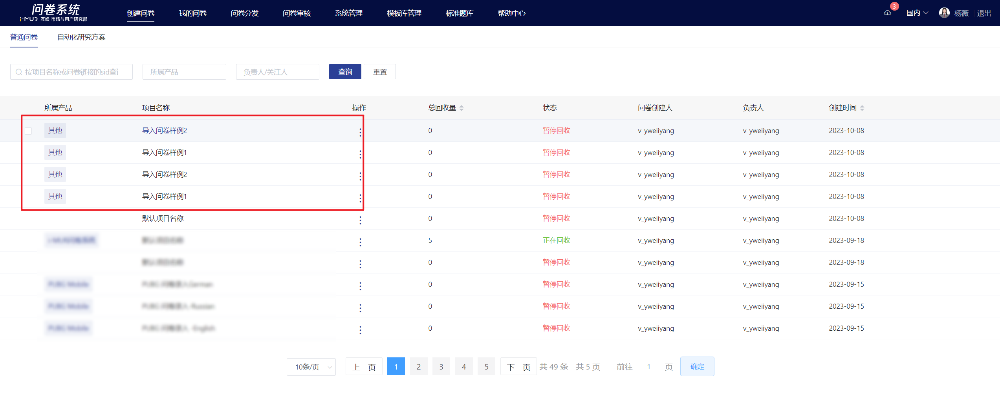

# Survey Auto Import

If you already have a designed Excel survey, you can directly use the "Automatic Survey Import" feature to import the survey text and create an online survey. This tool supports importing multiple

### 【STEP 1】 Edit survey content in EXCEL

The survey can be edited in advance in EXCEL, including: basic survey information (project name, product name, survey title, welcome message, ending message), question and option content (including font style), question settings, page settings, simple logic settings, etc.

<figure><figcaption></figcaption></figure>

\# Format Guidelines

1. The first 5 rows contain basic questionnaire information:
   * Column A: Fixed values “Project Name”, “Product Name”, “Questionnaire Title”, “Welcome Message”, “Closing Message”.
   * Columns B, C: Always empty.
   * Column D: Specific content for “Project Name”, “Product Name”, “Questionnaire Title”, “Welcome Message”, “Closing Message.” These can be empty; if empty, system defaults will be applied. (The questionnaire title can be up to 50 characters.)
2. Row 6 is an empty spacer row.
3. From row 7, content of the questionnaire starts, recognizing the content of the first 4 columns, with an empty row between questions.
   * Column A: Question number or "**Page Break**". No spacer required between a "**Page Break**" and a question. Fixed value **0** in the information columns of Column A.
   * Column B: Question type; must match the system's naming: Single Choice, Multiple Choice, Dropdown, Open-ended, Matrix Single Choice, Matrix Multiple Choice, Matrix Scale, Information, Scale, Dropdown, Linked, File Upload, Sorting, Distribution.
   * Column C: Question settings, option settings.
   * Column D: Question body, notes, options; notes start with "**Note:**" and must be in Chinese. (Each column from D onward represents one questionnaire.)
4. Import supports text styles recognition including bold, italic, underline, strikethrough, font color.
5. Separator: For Matrix Single Choice and Matrix Multiple Choice questions, use the caret ^ to separate questions from options.
6. Special symbols: Angle brackets <> are not supported. Content within them will be automatically cleared on import, requiring online editing.
7. Question Settings:
   * (1) Non-mandatory: by default, questions are mandatory. For non-mandatory, enter **Non-mandatory** in Column C.
   * (2) Randomize options: if enabled, enter **Random Order** in Column C, specify **Not Random** for certain options in Column C.
   * (3) Min/Max selections: enter **Min**:m, **Max**:n in Column C to set limits, where m & n are numbers, m ≤ n.
   * (4) Randomize questions: supports Matrix Single, Multiple, Scale questions. Enter **Random Questions** in Column C to enable.
   *   (5) Scale question score:

       ① In Column D, enter lowest, ^, highest scores, and anomalies in the following lines.

       ② The first line is the lowest score, second is ^, third is highest score, fourth indicates anomalies if present.

       ③ Scores are integers and can be negative.
   * (6) Scale prompt instructions:
     * Left prompt in the lowest score line.
     * Middle prompt in the connector line.
     * Right prompt in the highest score line.
   * (7) Linked Questions support only question body and notes import, not option import.
8. Option Settings:
   * (1) Fill-in-the-blank: default is no fill-in, enter **Fill-in** in Column C if needed.
   * (2) Required fill-in: defaults to non-required unless noted, enter **Required** in Column C if needed.
   * (3) Exclusive option: supported by Multiple Choice only, enter **Exclusive** in Column C if needed.

## 【STEP 2】Import survey

On the survey creation page, click the "Survey Auto Import" button to enter the import page, and upload the edited EXCEL file.

<figure><figcaption></figcaption></figure>

## 【STEP 3】Confirm basic information

After uploading the EXCEL file, the system will automatically recognize the survey content and generate a survey list. The uploaded surveys support re-uploading or deletion (deleted surveys will not generate a survey). You can adjust the project name, product name, and survey title.

## 【STEP 4】Create an online survey

After confirming the survey information, click "Create Survey" to generate an online survey, which will be displayed in the "My Surveys" list.

