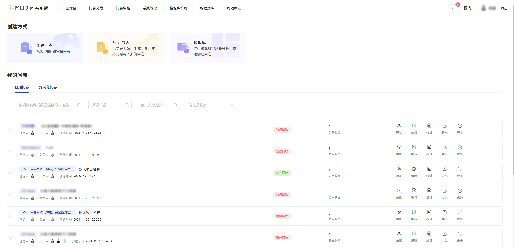

# 🖥️ System Introduction

The iMUR survey system provides professional online survey and statistical tools, serving domestic and overseas survey projects, with a focus on in-game embedded distribution.&#x20;

It not only offers question types such as single choice, multiple choice, open-ended, and matrix questions, but also provides features like option association (funnel), complex combination logic settings, and real-time statistics.


Domestic version：[https://surveyimur.woa.com](https://surveyimur.woa.com/)

Overseas Version：[https://www.outweisurvey.com](https://www.outweisurvey.com/#/)



Overseas Compliance： Instructions[https://docs.qq.com/doc/DS2RYa0lxV0tURkx2](https://docs.qq.com/doc/DS2RYa0lxV0tURkx2)

Product Update ：Log[https://iwiki.woa.com/pages/viewpage.action?pageId=4007751213](https://iwiki.woa.com/pages/viewpage.action?pageId=4007751213)


## <mark style="color:blue;">Main Features</mark>

Survey editing/distribution

* **Creation**: Multiple survey creation methods, supporting offline text import and flexible online editing
* **Question types**: Provide multiple question type options, suitable for different survey backgrounds
* **Logic:** Supports complex combination logic settings and funnel option settings
* **Deployment**: Multiple deployment domain names for free selection to improve deployment confidentiality, support setting channel numbers

In-game embedded/open interfaces

* **Embedded:** Provide in-game embedded placement, collect players' openid, and adapt to different terminals for answering (landscape/portrait mode on mobile, PC).
* **Interface**: Provide an answer data callback API to connect with external systems for subsequent reward distribution.

**Data Analysis**

* **Analysis**: Real-time online data statistics/cross-analysis, intuitive and concise chart display
* **Share**: Support link sharing of results, multi-user collaborative viewing

### Overseas System

* **Compliance**: Provide overseas survey respondent information verification to reduce privacy risk
* **Language**: Custom survey prompt language to meet overseas distribution needs

##

## <mark style="color:blue;">Focus on user experience</mark>

#### The interface features a lightweight and simple design with clear function entries.

<figure><figcaption>
Workbench
</figcaption></figure>

#### Continue using drag-and-drop selection to simplify editing operations

<figure><figcaption>
Survey Editor
</figcaption></figure>

#### Real-time automatic save updates to prevent content loss and confusion

<figure><figcaption>
Auto Save
</figcaption></figure>

#### Support in-game embedded ads, freely configure jump callbacks

<figure><figcaption></figcaption></figure>

#### Real-time statistics of survey data, intuitive chart display

<figure><figcaption>
答题结果统计
</figcaption></figure>

#### Various terminals automatically compatible, links can be distributed through multiple channels

.png>)

.png>)

