# Single Choice

Multiple choice allow respondents to select one option from a set of choices.

.png>)

## 【STEP 1】 Create new survey question

On the survey editing page, select "Single Choice Question" from the question type controls on the left side, or click the + button in the quick toolbar on the right side of a specified question to create a new single choice question.

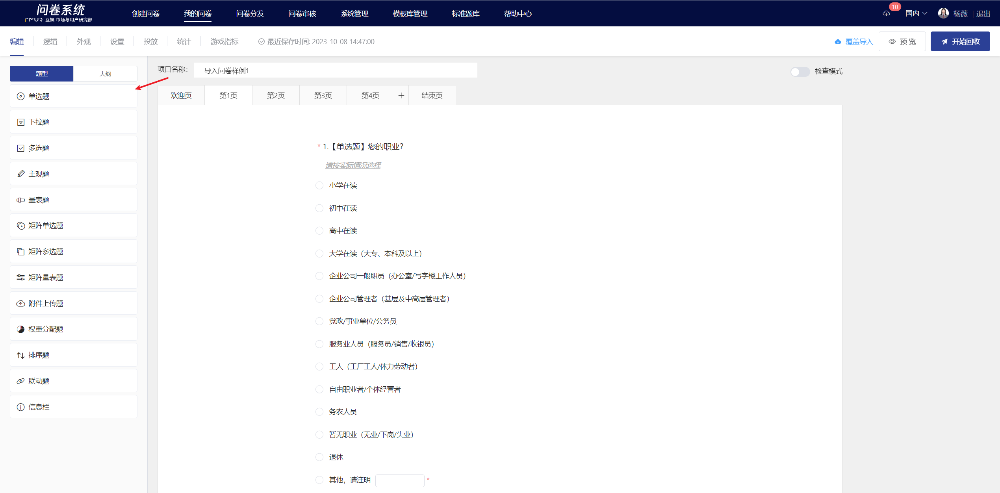

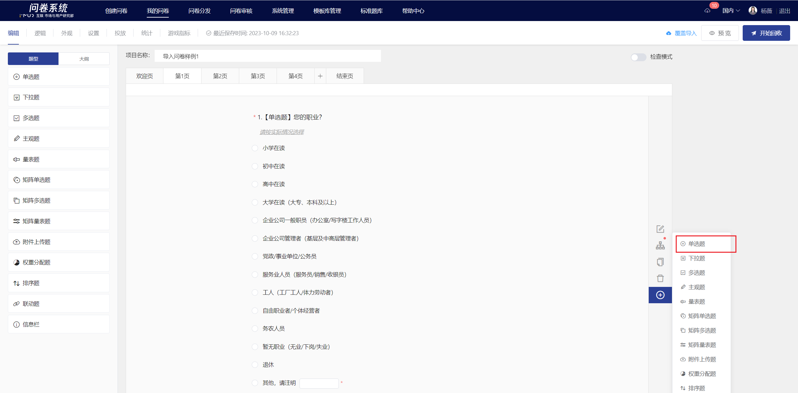

## 【STEP 2】Edit the question, notes, and options content

The title, options, and remarks all support rich text editing, including: font styles.[插入超链接](../../cao-zuo-zhi-yin/wen-juan-bian-ji/cha-ru-chao-lian-jie.md)、[插入图片](../../cao-zuo-zhi-yin/wen-juan-bian-ji/cha-ru-tu-pian.md)、[插入视频](../../cao-zuo-zhi-yin/wen-juan-bian-ji/cha-ru-shi-pin.md)、[引用选项内容](../../cao-zuo-zhi-yin/wen-juan-bian-ji/nei-rong-yin-yong.md)。

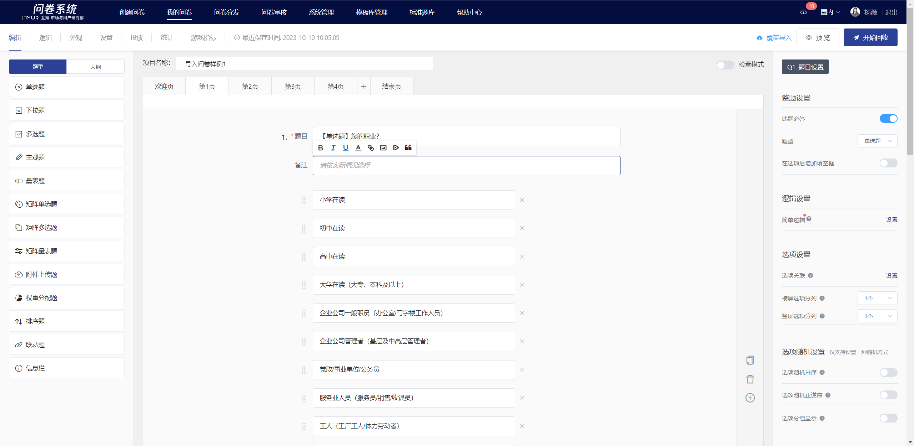

## 【STEP 3】Question and option settings

### Mandatory settings

After turning off the "This question is mandatory" feature in the right panel, this question can be left blank when answering.


All questions are set to "mandatory" by default.


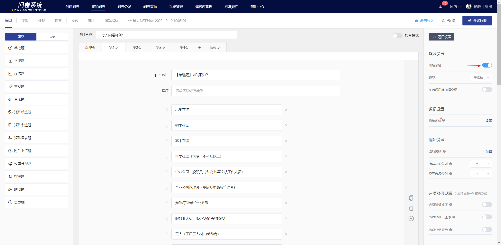

### Question Type

Single-choice, multiple-choice, and dropdown questions can be freely switched. After switching, the original question's required settings, option association settings, and random option settings are retained.

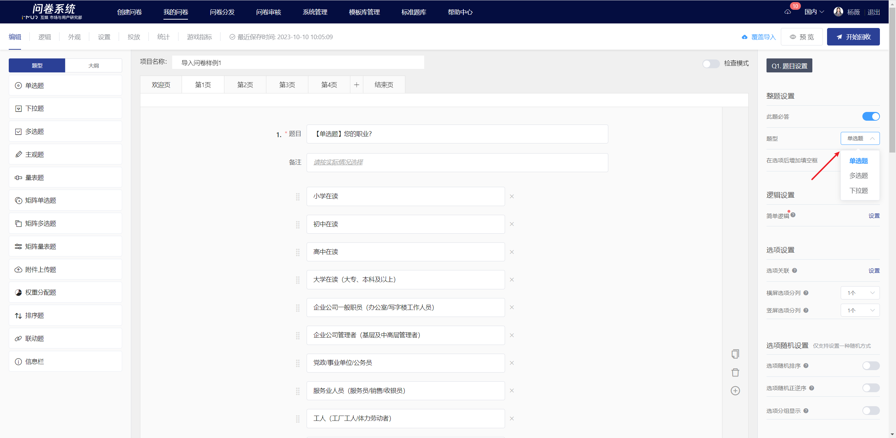

### Add a fill-in-the-blank box after the options

Upon opening, add a fill-in-the-blank box after the option, mark it as required, and users must fill in the content before submitting. This is suitable for scenarios where users select "Other" and additional information needs to be collected

<figure>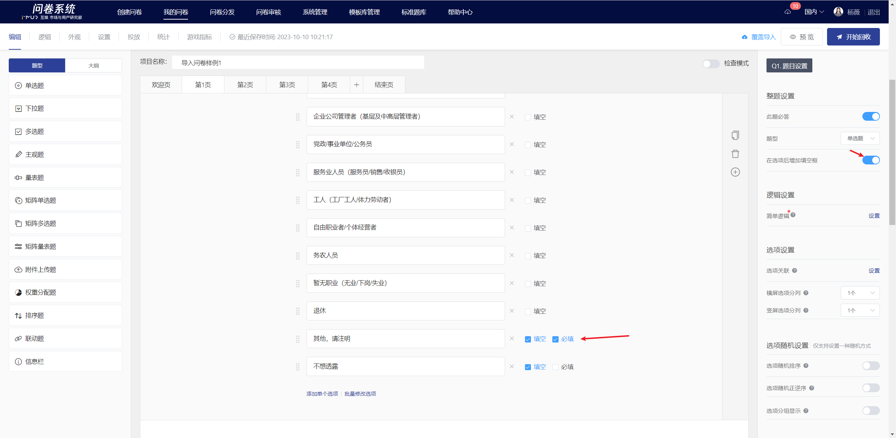<figcaption></figcaption></figure>

### Option Association

**Option Association**

Option association refers to displaying the selected (or unselected) options in the next question's available choices. This is typically used for highly related questions or follow-up inquiries.

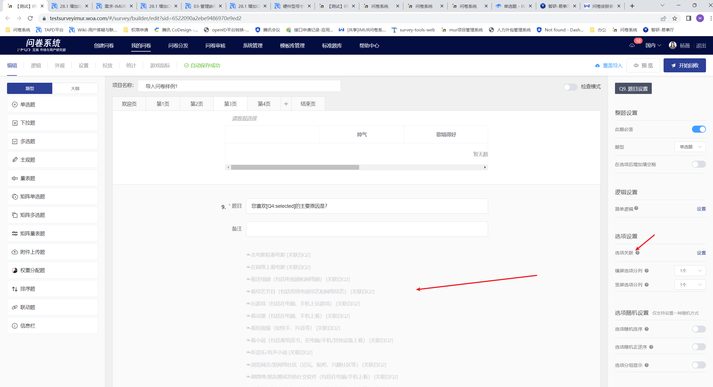


[xuan-xiang-guan-lian.md](../../cao-zuo-zhi-yin/wen-juan-bian-ji/xuan-xiang-she-zhi/xuan-xiang-guan-lian.md)


### Options Listing

In the question editing state, you can set the options to be displayed in columns. Once set, the answer interface will display the options in columns according to the number of options per row. In landscape mode, you can set 1 to 6 options per row, and in portrait mode, you can set 1 to 3 options per row. This is suitable for situations where there are many options and the option text is not long.

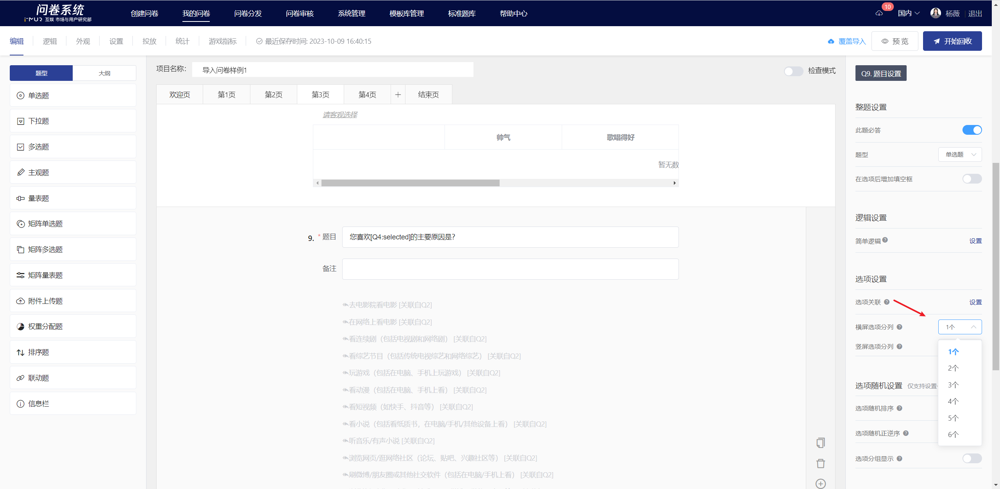

.png>)

### Options are random

In the question editing mode, options can be set to random. Once set successfully, the options will be displayed randomly on the answering end according to the chosen random method. The random methods include: random order, random forward and reverse order, and grouped display.

#### Randomize options

Random option ordering means that the options in a question appear in a random order when answering. After enabling the "Random option ordering" feature, a non-random checkbox will appear on the right side of the options. If you want a specific option to remain in its current position, you can check "Non-random" next to it, and that option will not participate in the random ordering.

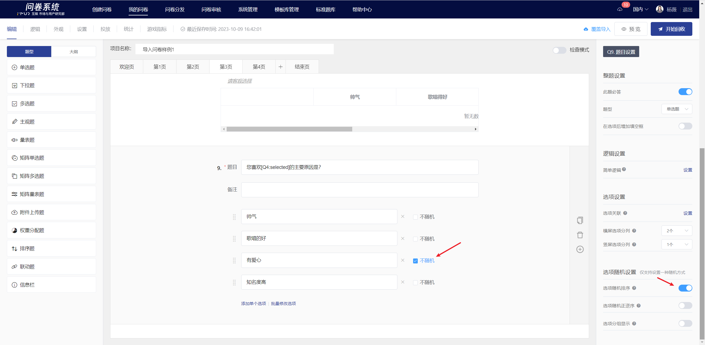

#### Options in random forward and reverse order

Random forward/reverse order of options means that the options in the question will randomly appear in forward or reverse order when answering. After enabling the "Random forward/reverse order of options" feature, a "Fix the last option" toggle will appear below the "Random forward/reverse order of options" feature. If you want the last option to remain in its current position, you can enable the "Fix the last option" feature, and the last option will not participate in the random forward/reverse order when displayed on the answering end.

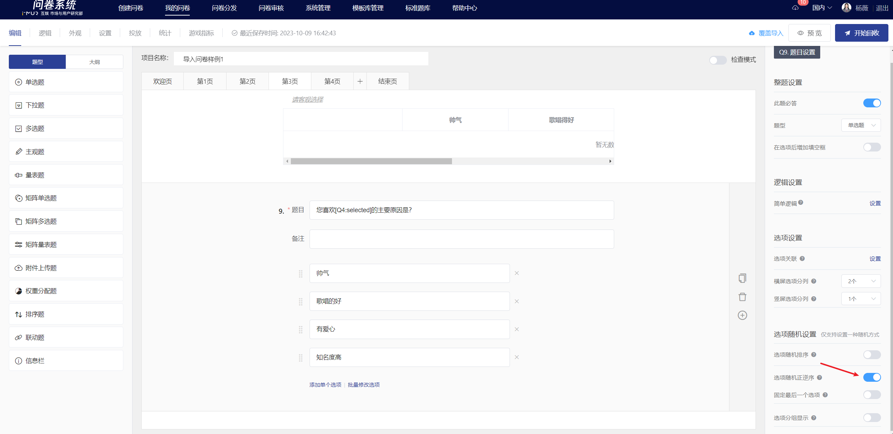

#### Grouped display of options

Option grouping display refers to the free division of options into multiple groups, where one or more options from each group are randomly selected to be displayed during the survey. It also supports random sorting display between groups.

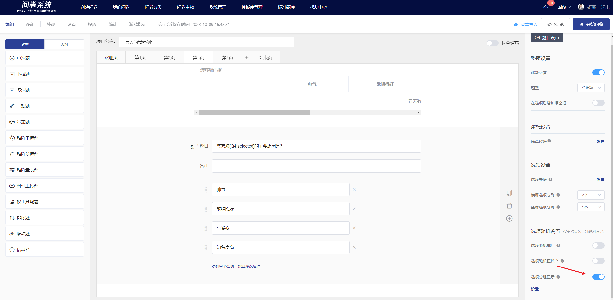


[xuan-xiang-sui-ji.md](../../cao-zuo-zhi-yin/wen-juan-bian-ji/xuan-xiang-she-zhi/xuan-xiang-sui-ji.md)


## Edit page and survey interface display

After editing, you can view the specific content of the single-choice questions and the associations of the options, content references, and fill-in-the-blank settings on the editing page.

.png>)

.png>)

## Survey Results

In the statistical analysis page, display the results of single-choice questions in the form of subtotal + bar percentage.

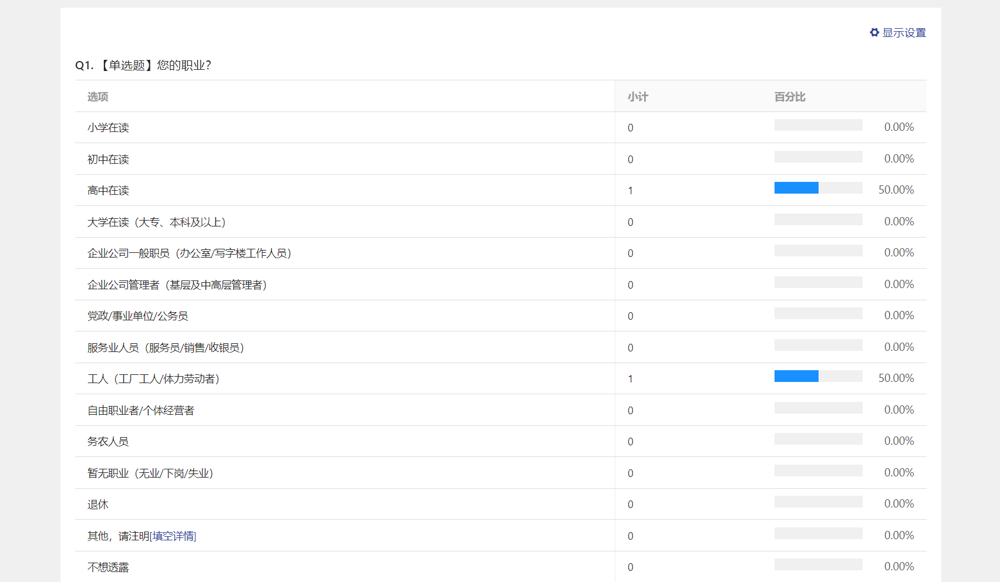

