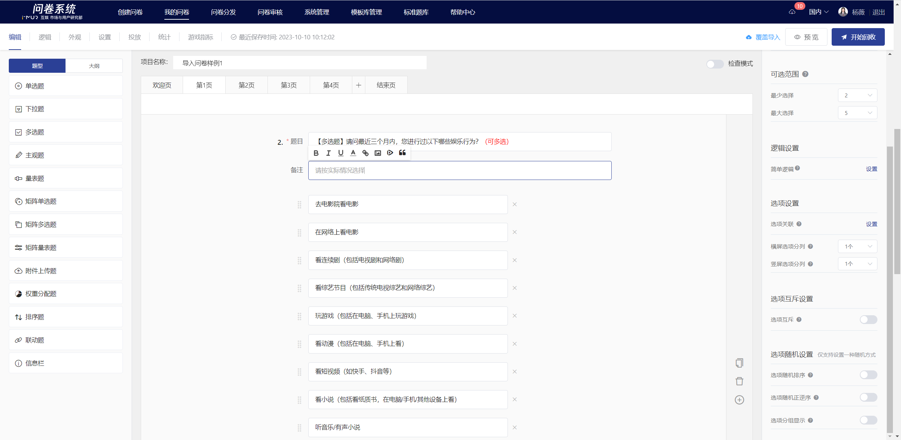

# Multiple Choice

Multiple choice allow respondents to select one or more choices from a set of choices.

<figure><figcaption></figcaption></figure>

## 【STEP 1】 Create new Multiple Choice&#x20;

On the survey editing page, select "Multiple Choice" from the question type controls on the left, or click the + button on the right quick toolbar of a specified question to choose "Multiple Choice Question" to create a new multiple choice question.

<figure><figcaption></figcaption></figure>

## 【STEP 2】Edit title, notes, and option content

The title, choices, and remarks all support rich text editing, including: font styles.Insert hyperlink, insert image, insert video, quote survey content.

## 【STEP 3】Question and Choice Settings

### Mandatory setting

After turning off the "Required" feature in the right panel, this question can be left blank when answering.


All questions are set to "mandatory" by default.


### Switch Question Type

Single-choice , multiple-choice , and dropdown  can be freely switched. After switching, the mandatory settings, option association settings, and option randomization settings of the original question will be retained.

<figure><figcaption></figcaption></figure>

### Add a fill-in-the-blank box after the choices

After enabling, a fill-in-the-blank box will be added behind the choices. When the required choice is checked, users must fill in the content before they can submit. This is suitable for scenarios where users select "Other" and need to provide additional related information.

<figure><figcaption></figcaption></figure>

### Optional Range

In multiple-choice questions, the number of options a user can select for a single question can be limited.

<figure><figcaption></figcaption></figure>

### Choice split

In the question editing state, you can set the choices to be displayed in columns. Once set successfully, the choices will be displayed in columns on the answering end based on the number of choices per row. In landscape mode, you can set 1 to 6 choices per row, and in portrait mode, you can set 1 to 3 choices per row. This is suitable for situations where there are many options and the choice text is not long.

<figure><figcaption></figcaption></figure>

### Mutually Exclusive Choices

Mutually exclusive choices in a multiple-choice question refer to designating a specific choice as mutually exclusive. If a user selects any of the options set as mutually exclusive while answering, they cannot select any other choices.

<figure><figcaption></figcaption></figure>

## Survey Results

On the statistical analysis page, display the responses to multiple-choice questions in the form of subtotal + bar percentage.

<figure><figcaption></figcaption></figure>

