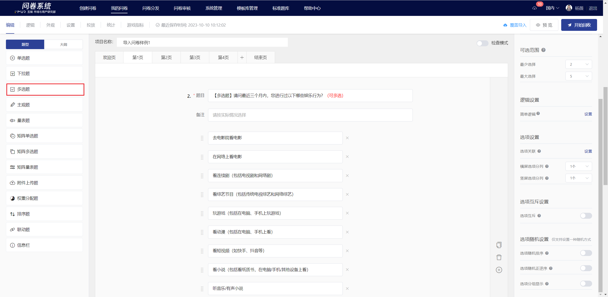
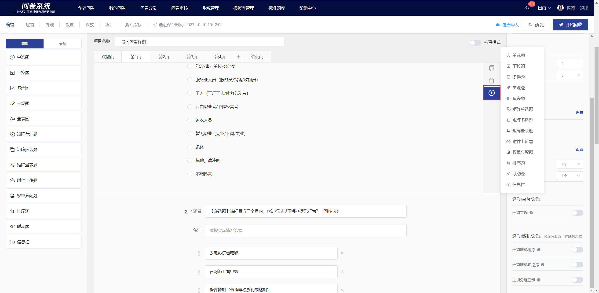
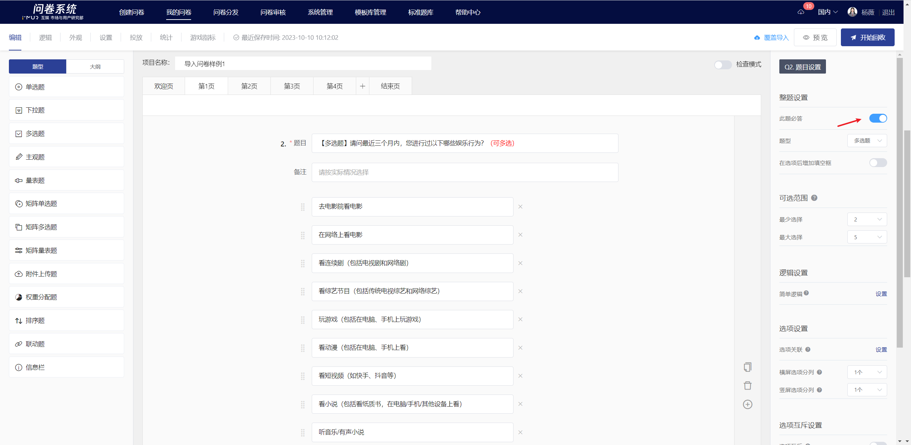
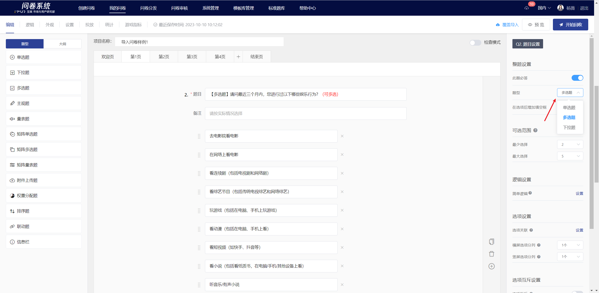
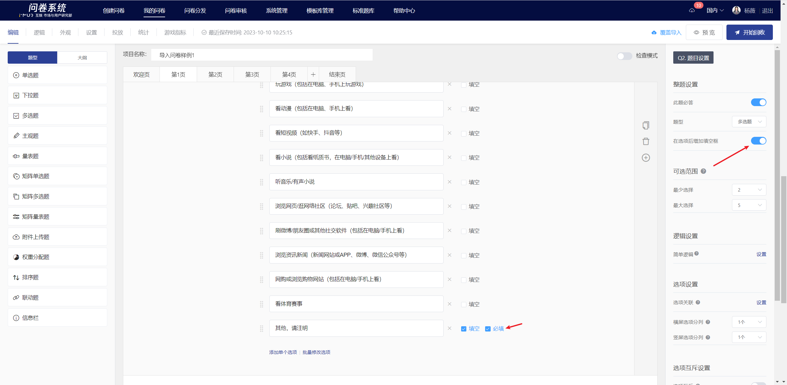
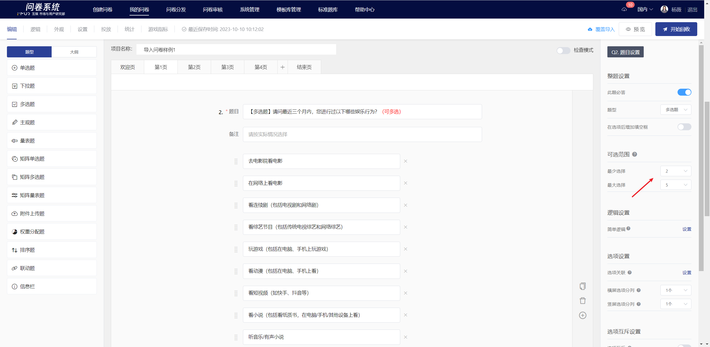
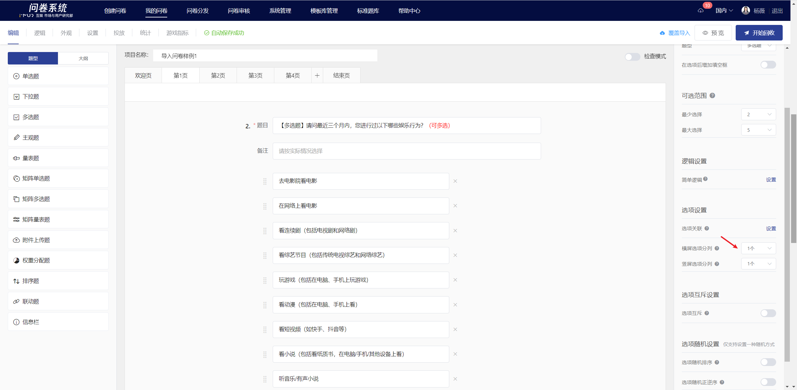
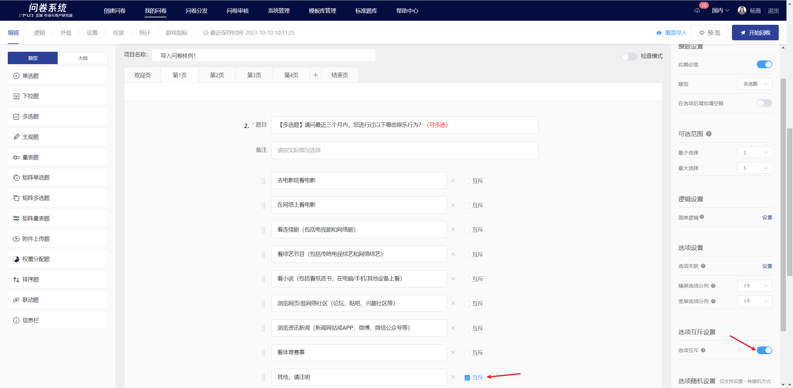
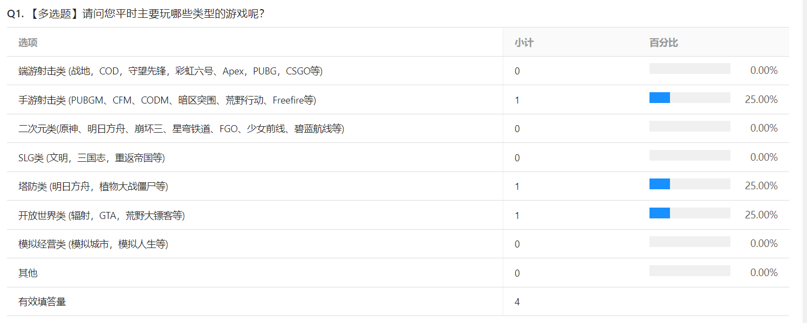

# Multiple Choice

Multiple choice allow respondents to select one or more options from a set of choices.

.png>)

## 【STEP 1】 Create new Multiple Choice&#x20;

On the survey editing page, select "Multiple Choice" from the question type controls on the left, or click the + button on the right quick toolbar of a specified question to choose "Multiple Choice Question" to create a new multiple choice question.

## 【STEP 2】Edit title, notes, and option content

The title, options, and remarks all support rich text editing, including: font styles.Insert hyperlink, insert image, insert video, quote survey content.

## 【STEP 3】Question and Option Settings

### Mandatory setting

After turning off the "Required" feature in the right panel, this question can be left blank when answering.


All questions are set to "mandatory" by default.


### Switch Question Type

Single-choice questions, multiple-choice questions, and dropdown questions can be freely switched. After switching, the mandatory settings, option association settings, and option randomization settings of the original question will be retained.

### Add a fill-in-the-blank box after the options

After enabling, a fill-in-the-blank box will be added behind the options. When the required option is checked, users must fill in the content before they can submit. This is suitable for scenarios where users select "Other" and need to provide additional related information.

<figure><figcaption></figcaption></figure>

### Optional Range

In multiple-choice questions, the number of options a user can select for a single question can be limited.

### Option split

In the question editing state, you can set the options to be displayed in columns. Once set successfully, the options will be displayed in columns on the answering end based on the number of options per row. In landscape mode, you can set 1 to 6 options per row, and in portrait mode, you can set 1 to 3 options per row. This is suitable for situations where there are many options and the option text is not long.

.png>)

### Mutually Exclusive Options

Mutually exclusive options in a multiple-choice question refer to designating a specific option as mutually exclusive. If a user selects any of the options set as mutually exclusive while answering, they cannot select any other options.

### Editor page and survey interface display

After editing, you can view the specific content of the multiple-choice questions, the association of options, content references, and fill-in-the-blank settings on the editing page.

.png>)

.png>)

## Survey Results

On the statistical analysis page, display the responses to multiple-choice questions in the form of subtotal + bar percentage.

