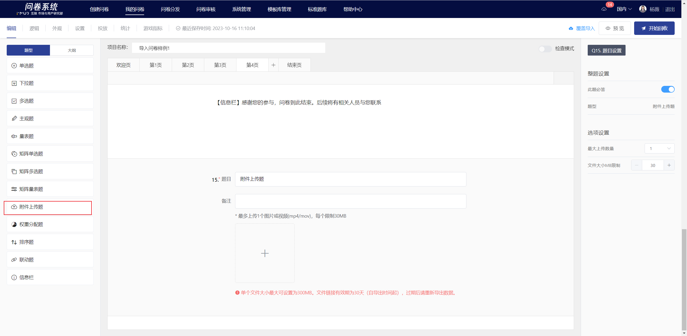
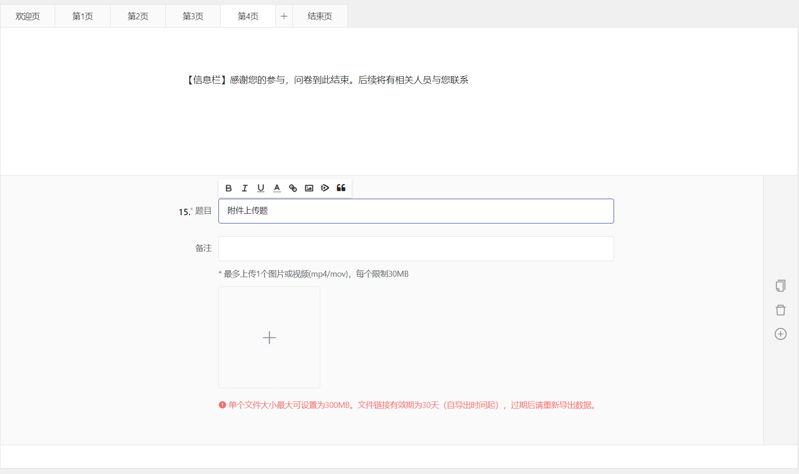
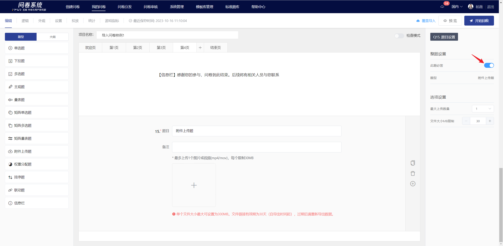
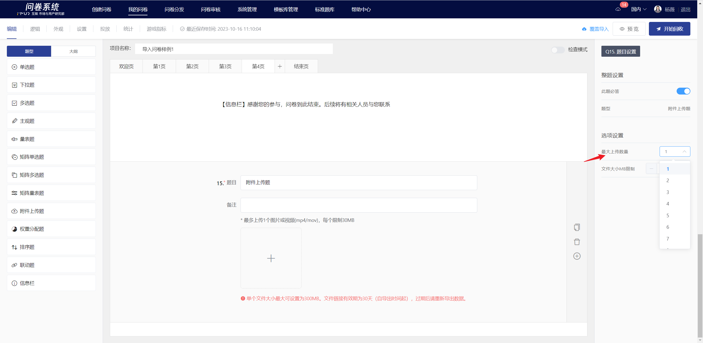
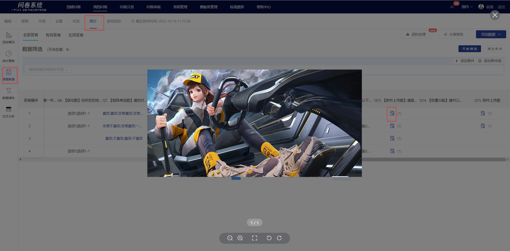

# File Upload

The file Upload requires respondents to upload images/videos as the answer to the question. It is suitable for collecting image or video files submitted by respondents.

.png>)

## 【STEP 1】 新建附件上传题

在问卷编辑页中，选择左侧题型控件中的“附件上传题”或在指定题目点击右侧快捷工具栏中的+按钮选择“附件上传题”即可创建附件上传题。

## 【STEP 2】Edit title, notes, and option content

The title, options, and remarks all support rich text editing, including: font styles.Insert hyperlink, insert image, insert video, quote survey content.

## 【STEP 3】题目设置

### 必答设置

在右侧面板中关闭“此题必答”功能后，答题时此题可以为空。


所有题目默认开启“此题必答”功能。


### 最大上传数量

附件上传题可限制上传文件数量，设置成功后，在答题端会根据所设置的上传文件数量自动校验答案。


1. 默认每题仅支持上传1个文件
2. 最多可设置最大上传数量为20


## 文件大小MB限制

可设置单个文件大小，最大可设置为300MB

<figure><figcaption></figcaption></figure>

##

## 编辑页及答题端显示

编辑完成后，在编辑页内可查看附件上传题的显示样式。

.png>)

.png>)

## 查看答题数据

统计页可查看每个答题者上传的图片/视频。

## 下载答题数据

附件上传题的文件暂不支持下载，仅支持在线查看附件内容，在导出数据的文件中可以点击查看。


导出的数据中，文件链接有效期为30天（自导出时间起），过期后请重新导出数据。


.png>)

## 统计结果展示

在统计分析页中，仅展示该附件上传题的有效填答量，不展示具体上传的文件详情，查看文件详情需前往"答题数据"或导出数据查看。

