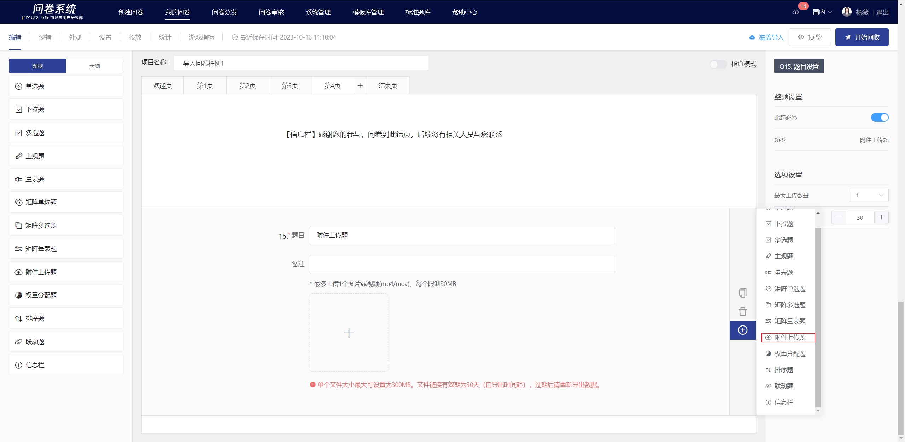

# File Upload

The file Upload requires respondents to upload images/videos as the answer to the question. It is suitable for collecting image or video files submitted by respondents.

.png>)

## 【STEP 1】 Creat new file upload

On the survey editing page, select the "Attachment Upload Question" from the question type controls on the left or click the + button in the quick toolbar on the right of the specified question to create an attachment upload question.

## 【STEP 2】Edit title, notes, and option content

The title, options, and remarks all support rich text editing, including: font styles.Insert hyperlink, insert image, insert video, quote survey content.

## 【STEP 3】Title, questions, and options settings

### Mandatory settings

After turning off the "This question is mandatory" feature in the right panel, this question can be left blank when answering.


By default, the "mandatory question" feature is enabled for all questions.


### Maximum upload limit

The attachment upload question can limit the number of files uploaded. Once the settings are successfully configured, the answer will be automatically validated on the answering end based on the set number of uploaded files.


1. By default, only one file can be uploaded per question
2. The maximum upload limit can be set to 20.


### File size MB limit

The size of a single file can be set, with a maximum limit of 300MB.

<figure><figcaption></figcaption></figure>

##

## Editor page and survey interface display

After editing, you can view the display style of the attachment upload question on the editing page.

.png>)

.png>)

## View survey data

On the statistics page, you can view the images/videos uploaded by each respondent.

## Download survey data

附件上传题的文件暂不支持下载，仅支持在线查看附件内容，在导出数据的文件中可以点击查看。


导出的数据中，文件链接有效期为30天（自导出时间起），过期后请重新导出数据。


.png>)

## 统计结果展示

在统计分析页中，仅展示该附件上传题的有效填答量，不展示具体上传的文件详情，查看文件详情需前往"答题数据"或导出数据查看。

