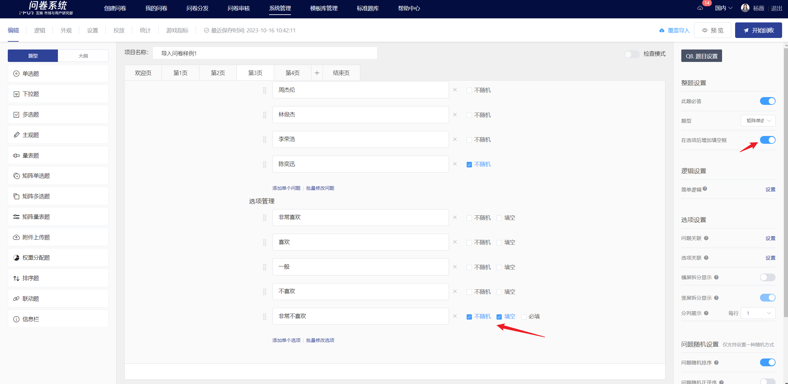

# Matrix Single Choice

Matrix single choice list multiple questions or options in a matrix format, and visitors need to select one answer for each question.

## 【STEP 1】 Create New Matrix Single Choice Question

On the survey editing page, you can create a new matrix single-choice question by selecting "Matrix Single Choice Question" from the question type controls on the left, or by clicking the + button on the right quick toolbar of a specified question and selecting "Matrix Single Choice Question".

## 【STEP 2】Edit title, notes, and option content

The title, options, and remarks all support rich text editing, including font styles.[插入超链接](../../cao-zuo-zhi-yin/wen-juan-bian-ji/cha-ru-chao-lian-jie.md)、[插入图片](../../cao-zuo-zhi-yin/wen-juan-bian-ji/cha-ru-tu-pian.md)、[插入视频](../../cao-zuo-zhi-yin/wen-juan-bian-ji/cha-ru-shi-pin.md)、[引用选项内容](../../cao-zuo-zhi-yin/wen-juan-bian-ji/nei-rong-yin-yong.md)。

After editing, you can preview the matrix where each row represents a question and each column represents an option.

## 【STEP 3】Title, Questions, and Options Setup

### Mandatory settings

After turning off the "This question is mandatory" feature in the right panel, this question can be left blank when answering.


All questions have the "mandatory" option enabled by default.


### Add a fill-in-the-blank box after the options

After enabling, add a fill-in-the-blank box behind the option. Check the required field, and the user must fill in the content before submitting. This is suitable for scenarios where users select other options and need to collect additional related information.

<figure><figcaption></figcaption></figure>

### Option Association

Option association allows the selected (or unselected) options to be displayed as options in this matrix single-choice question. It is generally used in situations where two questions are highly relevant or for follow-up questions.


[xuan-xiang-guan-lian.md](../../cao-zuo-zhi-yin/wen-juan-bian-ji/xuan-xiang-she-zhi/xuan-xiang-guan-lian.md)


### Options are random

In the question editing state, options can be set to random. Once successfully set, the options will be displayed in the answer interface according to the chosen random method. The randomization methods for matrix single-choice questions include: random order and random reverse order.

### Randomize options

Randomizing options means that the options in the question will appear in a random order when answering. After enabling the "Randomize Options" feature, a non-random checkbox will appear to the right of the options. If you want a certain option to remain in its current position, you can check "Non-random" next to it, and that option will not be included in the random sorting.

.png>)

### Options in random forward and reverse order

Random forward/reverse order of options means that the options in the question appear in a random forward or reverse order when answering. After enabling the "Random forward/reverse order of options" feature, a "Fix the last option" switch will appear below it. If you want the last option to remain in its current position, you can enable the "Fix the last option" feature. In this case, the last option will not participate in the random forward/reverse order when displayed on the answering end.


[xuan-xiang-sui-ji.md](../../cao-zuo-zhi-yin/wen-juan-bian-ji/xuan-xiang-she-zhi/xuan-xiang-sui-ji.md)


### Issue correlation

Question association means that the options selected (or not selected) by the respondent are displayed in the questions of this matrix single-choice question. It is generally used in cases where the two questions are highly related or in follow-up questions.

### Questions are random

In the question editing state, you can set the questions in a matrix single-choice survey to be displayed randomly. Once set, the questions will be displayed in the response interface according to the selected random method. The random methods for questions in a matrix single-choice survey include: random order and random forward/reverse order.

### Random order of questions

Question randomization refers to the questions in the matrix single-choice question appearing in a random order when answering. After enabling the "question randomization" feature, a non-random checkbox will appear on the right side of each question. If you want a particular question to remain in its current position, you can check the "non-random" box next to it, and that question will not be included in the randomization.

### Questions in random forward and reverse order

Random forward/reverse order of questions means that the questions in the matrix single-choice question appear in a random forward or reverse order when answering. After enabling the "Random forward/reverse order of questions" function, a "Fix the last question" function switch will appear below it. If you want to fix the last question in its current position, you can enable the "Fix the last question" function, so that the last question will not participate in the random forward/reverse order when displayed on the answering end.

### Display on the editing page and the survey answering interface

After editing, you can view the specific content of the matrix single-choice questions, the association of options, content references, and fill-in-the-blank settings on the editing page.

矩阵单选题会根据答题终端自适应展示为矩阵或问题拆分形式。

## 统计结果展示

在统计分析页中，以条形图+表格小计的形式展示矩阵单选题的填答结果。

