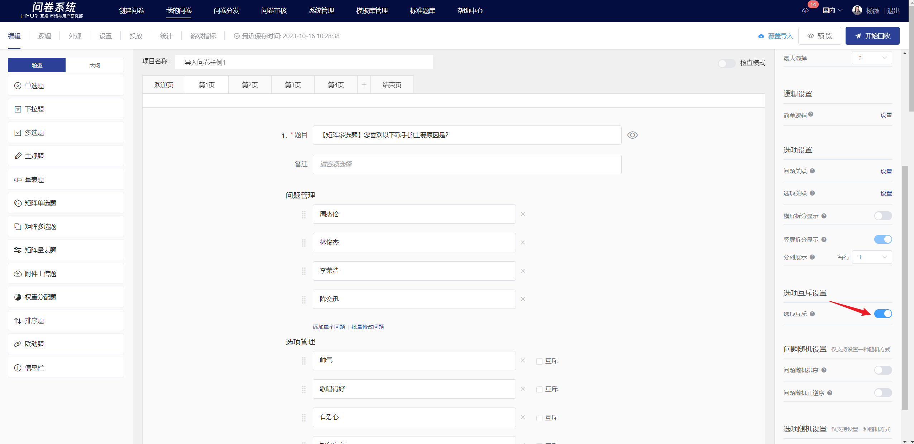
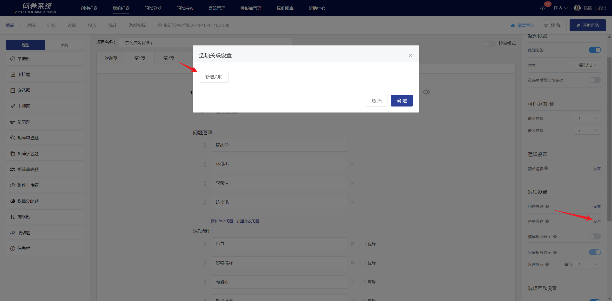

# Matrix Multiple Choice

Matrix multiple choice list multiple questions and multiple options in a matrix format, where respondents need to select one or more answers for each question.

## 【STEP 1】 Create New Matrix Multiple Choice&#x20;

On the survey editing page, you can create a new matrix multiple-choice question by selecting "Matrix Multiple-Choice Question" from the question type controls on the left side or by clicking the + button on the quick toolbar on the right side of a specified question to choose "Matrix Multiple-Choice Question".

## 【STEP 2】Edit title, notes, and option content

The title, options, and remarks all support rich text editing, including: font styles.Insert hyperlink, insert image, insert video, quote survey content.

After editing, you can preview the matrix. Each row in the matrix represents a question, and each column represents an option.

## 【STEP 3】Title, questions, and options settings

### Mandatory settings

After turning off the "This question is mandatory" feature in the right panel, this question can be left blank when answering.


By default, the "mandatory question" feature is enabled for all questions.


### Add a fill-in-the-blank box after the options

After enabling, add a text box behind the options. If the required option is checked, the user must fill in the content before submitting. This is suitable for scenarios where users select "Other" and need to provide additional information.

<figure><figcaption></figcaption></figure>

### Optional Range

In matrix multiple-choice questions, the number of options a user can select for the same question can be limited.

### Mutually exclusive options

In a matrix multiple-choice question, mutually exclusive options refer to designating a certain option as an exclusive item. If the user selects this exclusive option while answering, they cannot select any other options for that question. Multiple exclusive options can be set.

### Option Association

Option association allows the selected (or unselected) options to be displayed as options in this matrix single-choice question. It is generally used in situations where two questions are highly relevant or for follow-up questions.


[xuan-xiang-guan-lian.md](../cao-zuo-zhi-yin/wen-juan-bian-ji/xuan-xiang-she-zhi/xuan-xiang-guan-lian.md)


### Options are random

In the question editing state, options can be set to random. Once successfully set, the options will be displayed in the answer interface according to the chosen random method. The randomization methods for matrix single-choice questions include: random order and random reverse order.

### Randomize options

Randomizing options means that the options in the question will appear in a random order when answering. After enabling the "Randomize Options" feature, a non-random checkbox will appear to the right of the options. If you want a certain option to remain in its current position, you can check "Non-random" next to it, and that option will not be included in the random sorting.

### Options in random forward and reverse order

Random forward/reverse order of options means that the options in the question appear in a random forward or reverse order when answering. After enabling the "Random forward/reverse order of options" feature, a "Fix the last option" switch will appear below it. If you want the last option to remain in its current position, you can enable the "Fix the last option" feature. In this case, the last option will not participate in the random forward/reverse order when displayed on the answering end.

### Issue correlation

Question association means that the options selected (or not selected) by the respondent are displayed in the questions of this matrix multiple-choice question. It is generally used in cases where two questions are highly relevant or in follow-up questions.

### Questions are random

In the question editing state, you can set the questions in a matrix single-choice survey to be displayed randomly. Once set, the questions will be displayed in the response interface according to the selected random method. The random methods for questions in a matrix single-choice survey include: random order and random forward/reverse order.

### Random order of questions

Question randomization refers to the questions in the matrix single-choice question appearing in a random order when answering. After enabling the "question randomization" feature, a non-random checkbox will appear on the right side of each question. If you want a particular question to remain in its current position, you can check the "non-random" box next to it, and that question will not be included in the randomization.

#### Random forward and reverse order of questions

Random forward/reverse order of questions means that the questions in the matrix single-choice question appear in a random forward/reverse order when answering. After enabling the "Random forward/reverse order of questions" feature, a "Fix the last question" switch will appear below the "Random forward/reverse order of questions" feature. If you want the last question to remain in its current position, you can enable the "Fix the last question" feature, and the last question will not participate in the random forward/reverse order when displayed on the answering end.

### Display of the editing page and survey answering interface

After editing, you can view the specific content of the matrix multiple-choice questions, the association of options, content references, and fill-in-the-blank settings on the editing page.

Matrix multiple-choice questions will adaptively display as a matrix or in a split-question format based on the answering terminal.

## Survey Results

On the statistical analysis page, the results of the matrix single-choice questions are displayed in the form of a bar chart and a table subtotal.

