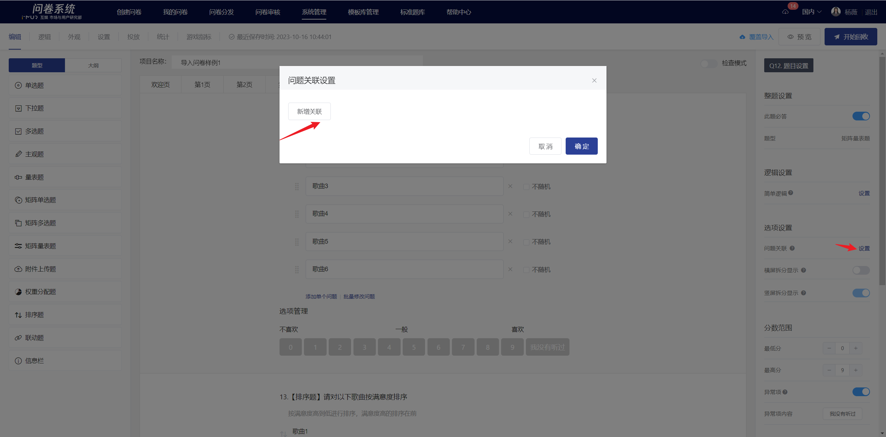

# Matrix Scale

Matrix scale measure respondents' feelings or attitudes towards multiple similar issues through preset numerical range values.

<figure><figcaption></figcaption></figure>

## 【STEP 1】 Create new matrix scale

On the survey editing page, select the "Matrix Scale " from the question type controls on the left side, or click the + button in the quick toolbar on the right side of a specified question to choose "Matrix Scale Question" and create a new matrix scale question.

<figure><figcaption></figcaption></figure>

## 【STEP 2】Edit title, notes, and choice content

The title, options, and remarks all support rich text editing, including: font styles.Insert hyperlink, insert image, insert video, quote survey content.

<figure><figcaption></figcaption></figure>

## 【STEP 3】Title, questions, and choices settings

### Mandatory settings

After turning off the "This question is mandatory" feature in the right panel, this question can be left blank when answering.


By default, the "mandatory question" feature is enabled for all questions.


<figure><figcaption></figcaption></figure>

### Score Range

The score range is the measurement scale for the scale question, with a range of 1 and a maximum difference of 11 between the lowest and highest scores. Once set, the scale can be viewed in real-time in the editing area.

<figure><figcaption></figcaption></figure>


Support setting exception items:

After enabling the exception item feature, you can customize the display text for exception items. Exception items are not counted towards the valid response count and are not scored.


### Prompt method

The prompt method is to set scale prompts, with the left prompt corresponding to the lowest score and the right prompt corresponding to the highest score; when the scale is displayed in reverse order, the prompts will also be displayed in reverse order accordingly.

### Question relevance

Question association allows the selected (or unselected) options by the respondent to be displayed in the questions of this matrix scale question. It is generally used in cases where two questions are highly related or for follow-up questions.

### Questions are randomized

In the question editing state, you can set the questions in the matrix scale question to display randomly. Once set successfully, the questions will be displayed according to the selected random method on the survey end. The random methods for questions in the matrix scale question include: random order, random forward and reverse order.

#### Random order of questions

Question randomization refers to the questions in the matrix scale appearing in random order when answering. After enabling the "question randomization" feature, a non-random checkbox will appear on the right side of each question. If you want a specific question to remain in its current position, you can check "non-random" next to it, and that question will not be included in the randomization.

#### Random forward and reverse order of questions

Random forward and reverse order of questions means that the questions in the matrix scale appear in a random forward or reverse order when answering. After enabling the "Random forward and reverse order of questions" feature, a "Fix the last question" toggle will appear below the "Random forward and reverse order of questions" feature. If you want the last question to remain in its current position, you can enable the "Fix the last question" feature, so that the last question will not participate in the random forward and reverse order when displayed on the answering end.

### Options are randomized

In the question editing mode, you can set options to be randomized. Once successfully set, the score will be displayed on the answering end according to the chosen randomization method. The randomization methods for the matrix scale options include: random forward and reverse order, and score inversion.

#### Options are randomly ordered in forward or reverse sequence

Random ordering of options refers to the scores in the questions appearing in random ascending/descending order when answering, for example: respondent A sees the scores as 12345, while respondent B sees the scores as 54321.

#### Score Reversal

Score reversal refers to the presentation of a scale in reverse order when answering questions, i.e., from the highest score to the lowest score, with the prompts displayed in the corresponding reverse order.


When the exceptions are enabled, they are fixedly displayed on the right side.


.png>)

## Editing page and survey response interface

After editing, you can view the specific content of the matrix scale questions and the association of options, content references, and fill-in-the-blank settings on the editing page.

Matrix scale questions will adaptively display as a matrix or split questions based on the answering terminal.

.png>)

.png>)

## Survey Results

In the statistical analysis page, display the response results of the matrix single-choice question in the form of table subtotal + bar percentage.


Anomalies are not included in the valid response count and are not included in the average score.


