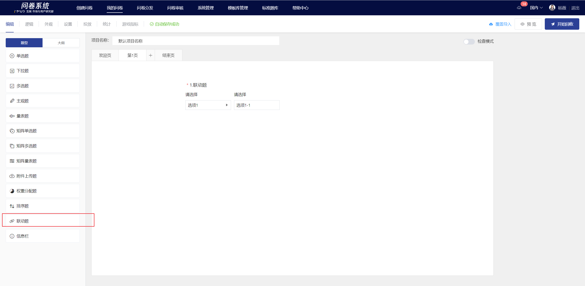
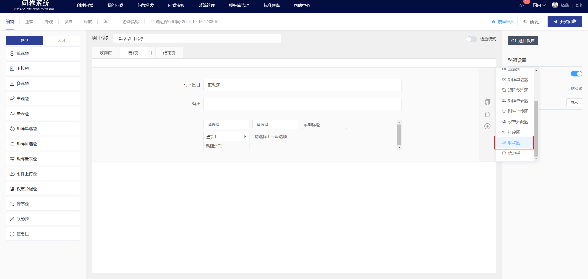
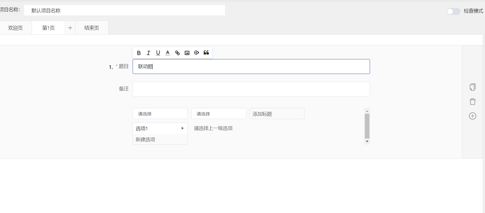
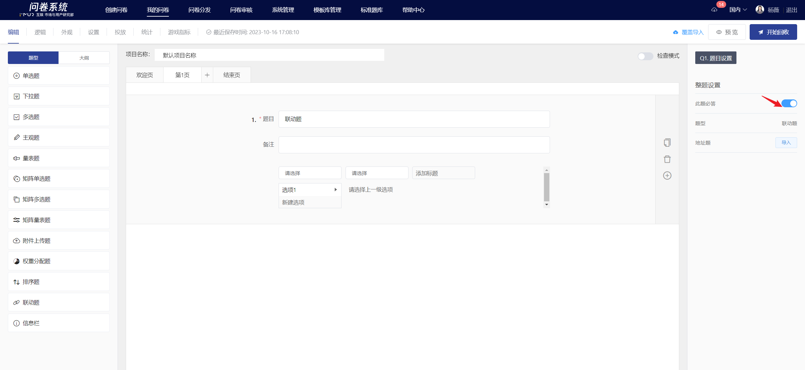
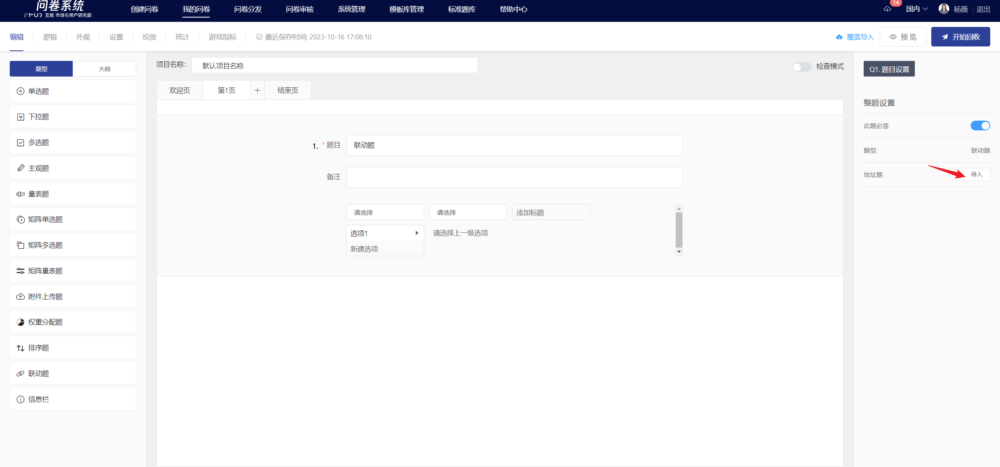
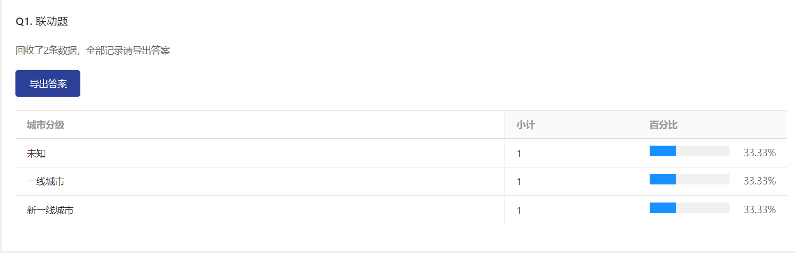

# Multi level linkage

Collaborative questions can achieve multi-level classification and factor correlation analysis, such as region, industry, major, university, etc. Additionally, multi-level linked drop-down menus can be freely edited, with each level's options having a hierarchical relationship. This means that the options in the first level can be subdivided into the second level options.

## 【STEP 1】 新建联动题

在问卷编辑页中，选择左侧题型控件中的“联动题”或在指定题目点击右侧快捷工具栏中的+按钮选择“联动题”即可新建联动题。

## 【STEP 2】Edit title, notes, and option content

The title, options, and remarks all support rich text editing, including: font styles.Insert hyperlink, insert image, insert video, quote survey content.

## 【STEP 3】题目设置

### 必答设置

在右侧面板中关闭“此题必答”功能后，答题时此题可以为空。


所有题目默认开启“此题必答”功能。


### 地址题

系统提供地址题预设选项，省市区选项列表导入即可使用，导入后支持手动二次编辑。

## 编辑页及答题端显示

编辑完成后，在编辑页内可查看联动题的具体内容及答题框设置。

.png>)

.png>)

## 统计结果展示

在统计分析页中，仅支持导出联动题的填答结果，点击“导出答案”可导出该题所有的答案详情（在[离线下载](../../cao-zuo-zhi-yin/xia-zai-shu-ju/li-xian-xia-zai.md)中进行下载）；地址题则会自动按城市分级统计

导出数据

导出原始数据/导出答题数据中，联动题按层级自动拆分为n列，每列答案为答题者在该层级中选中的答案（地址题会按答案自动标记所属城市分级）。

.png>)
