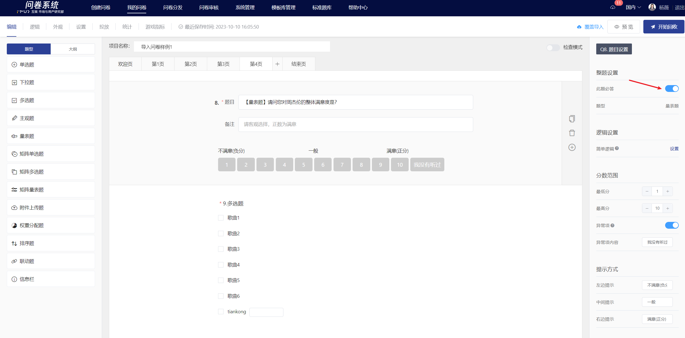
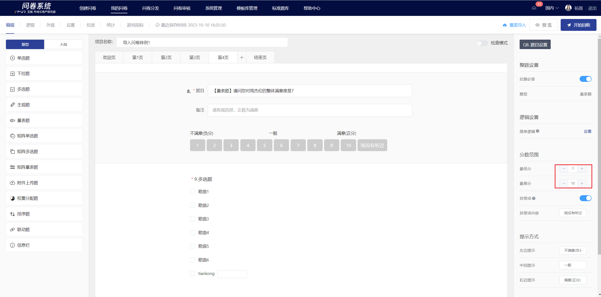
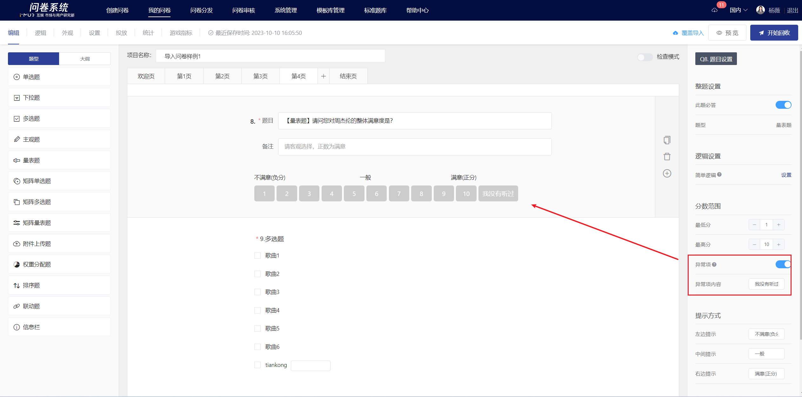
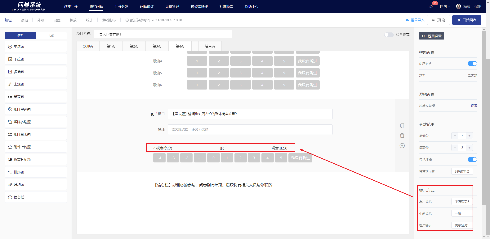
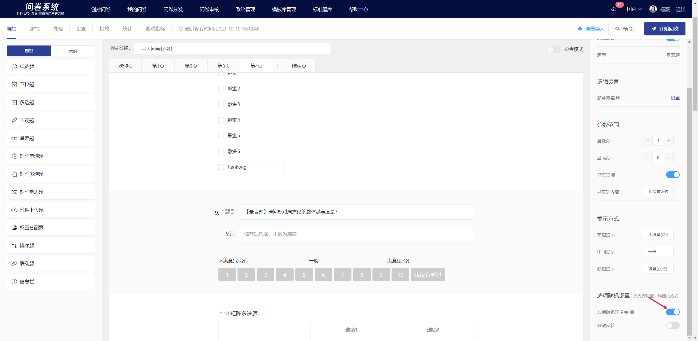
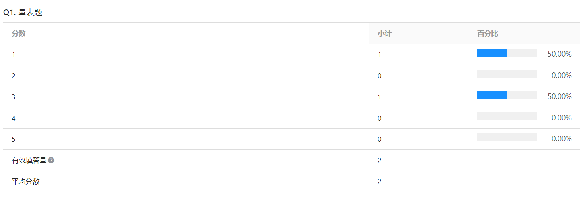

# Scale

Scale measure respondents' feelings or attitudes towards a particular issue using predefined numerical ranges.

 (1).png>)

## 【STEP 1】 新建量表题

在问卷编辑页中，选择左侧题型控件中的“量表题”或在指定题目点击右侧快捷工具栏中的+按钮选择“量表题”即可新建量表题。

.png>)

## 【STEP 2】编辑题目、备注、选项内容

题目、备注均支持富文本编辑，包括：字体样式、[插入超链接](../../cao-zuo-zhi-yin/wen-juan-bian-ji/cha-ru-chao-lian-jie.md)、[插入图片](../../cao-zuo-zhi-yin/wen-juan-bian-ji/cha-ru-tu-pian.md)、[插入视频](../../cao-zuo-zhi-yin/wen-juan-bian-ji/cha-ru-shi-pin.md)、[引用选项内容](../../cao-zuo-zhi-yin/wen-juan-bian-ji/nei-rong-yin-yong.md)。

## 【STEP 3】题目及选项设置

### 必答设置

在右侧面板中关闭“此题必答”功能后，答题时此题可以为空。


所有题目默认开启“此题必答”功能。


### 分数范围

分数范围即设置量表题的量度，刻度为1，最低分与最高分之间差值仅支持10以内；设置后可在编辑区实时查看量表情况。


支持设置异常项：&#x20;

开启异常项功能后，自定义设置异常项的显示文案，异常项不计入有效填答量、不计分。


### 提示方式

提示方式即设置量表提示语，左边提示语对应最低分，右边提示语对应最高分；当量表逆序显示时，提示语会相应逆序展示。

### 选项随机

在题目编辑状态下，可设置选项随机，设置成功后，在答题端会根据所选择的随机方式显示量表。量表题的随机方式包括：随机正逆序、分数反转。

#### 随机正逆序

随机正逆序是指答题时量表随机以正序/逆序展示，最低分->最高分或最高分->最低分，提示语相应正序/逆序展示。

#### 分数反转

分数反转是指答题时量表以逆序展示，即最高分->最低分，提示语相应逆序展示。

.png>)

## 编辑页及答题端显示

编辑完成后，在编辑页内可查看量表题的具体内容及量表展示方式。

.png>)

.png>)

## 统计结果展示

在统计分析页中，以表格小计+条形百分比的形式展示量表题的填答结果。

