# Rank order

Rank order require respondents to order a set of options based on specific criteria or preferences. They are suitable for survey questions that assess respondents' attitudes or preferences towards multiple options.

.png>)

## 【STEP 1】 新建排序题

在问卷编辑页中，选择左侧题型控件中的“排序题”或在指定题目点击右侧快捷工具栏中的+按钮选择“排序题”即可创建排序题。

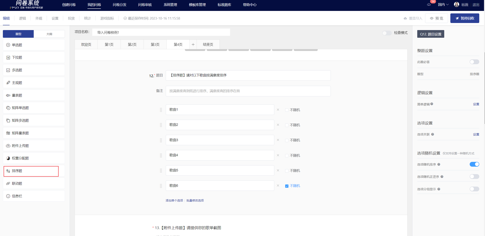

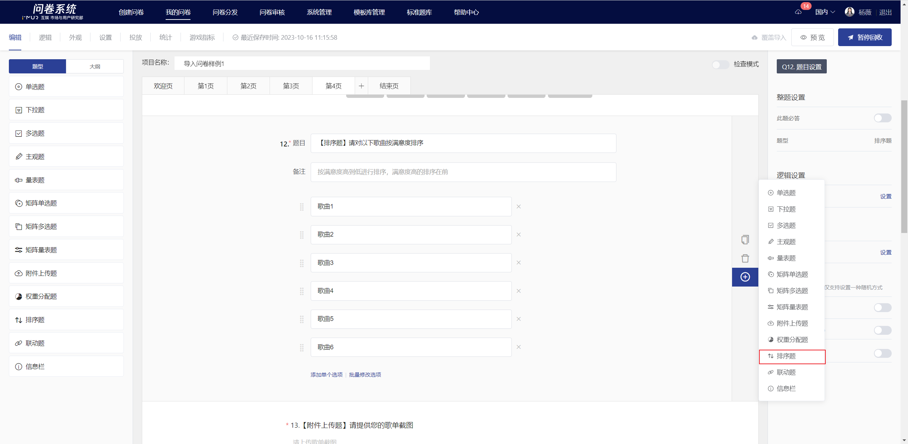

## 【STEP 2】Edit title, notes, and option content

The title, options, and remarks all support rich text editing, including font styles.[插入超链接](../../cao-zuo-zhi-yin/wen-juan-bian-ji/cha-ru-chao-lian-jie.md)、[插入图片](../../cao-zuo-zhi-yin/wen-juan-bian-ji/cha-ru-tu-pian.md)、[插入视频](../../cao-zuo-zhi-yin/wen-juan-bian-ji/cha-ru-shi-pin.md)、[引用选项内容](../../cao-zuo-zhi-yin/wen-juan-bian-ji/nei-rong-yin-yong.md)。

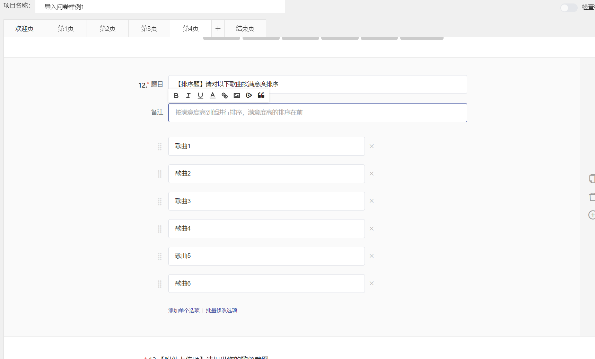

## 【STEP 3】题目设置

### 必答设置

在右侧面板中关闭“此题必答”功能后，答题时此题可以为空。


所有题目默认开启“此题必答”功能。


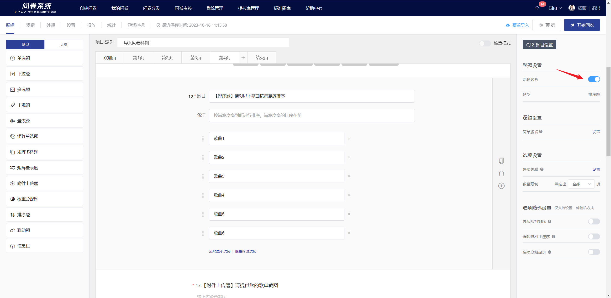

### 逻辑设置

排序题中指定选项的顺序可用于控制后序题目的显隐。如：Q1的选项1排序在第1或第2时显示Q2。

.png>)

### 选项关联

选项关联即让答题者选中（或未选中）的选项显示在下一题的可选项中，一般用于题目相关性极高的两题中或追问的情况。


仅支持关联单选题、多选题、下拉题的选项


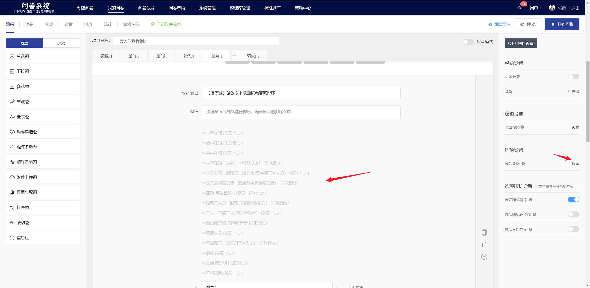

### 数量限制

排序题可支持限制答题者排序选项的数量，适用于在多个选项中让答题者选出最适合的几个选项的场景。

.png>)

### 选项随机

在题目编辑状态下，可设置选项随机，设置成功后，在答题端会根据所选择的随机方式显示选项。随机方式包括：随机排序、随机正逆序、分组显示。

#### 选项随机排序

选项随机排序是指答题时题目中的选项以随机顺序出现。开启“选项随机排序”功能后，题目的选项右侧会出现不随机的勾选框，若希望某个选项固定在当前位置，可在其后勾选“不随机”，则该选项不参与随机排序。

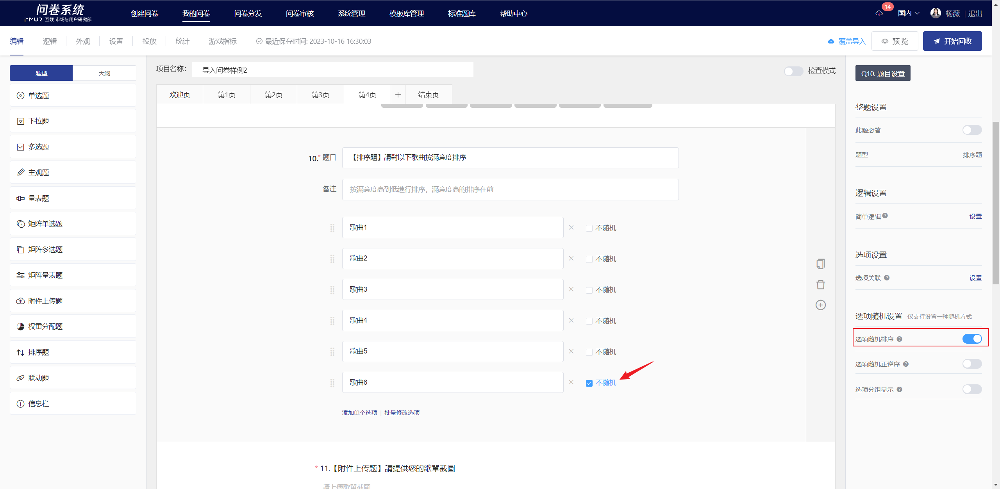

#### 选项随机正逆序

选项随机正逆序是指答题时题目中的选项随机以正序/逆序出现。开启“选项随机正逆序”功能后，“选项随机正逆序”功能下方会出现“固定最后一个选项”功能开关，若希望最后一个选项固定在当前位置，可开启“固定最后一个选项”功能，则在答题端显示时最后一个选项不参与随机正逆序。

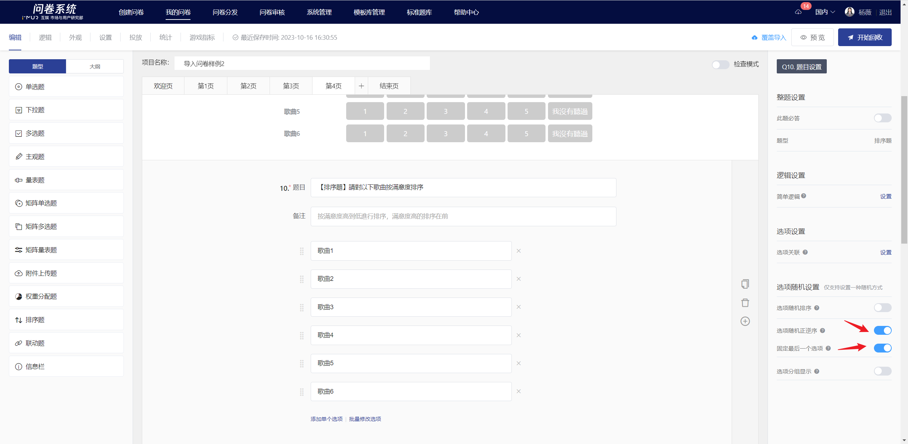

#### 选项分组显示

选项分组显示是指把选项自由划分为多个组别，答题时每个分组的选项随机抽出一个或多个显示，支持分组间随机排序显示。

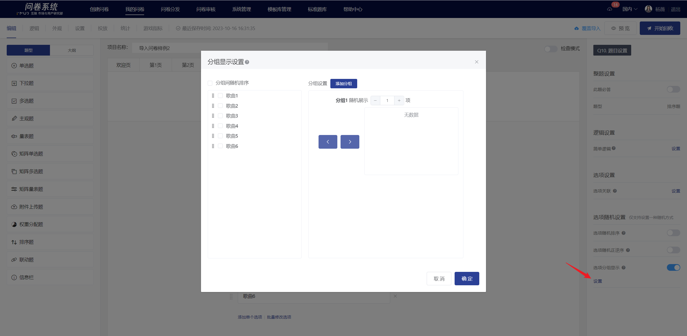

## 编辑页及答题端显示

编辑完成后，在编辑页内可查看排序的显示样式。

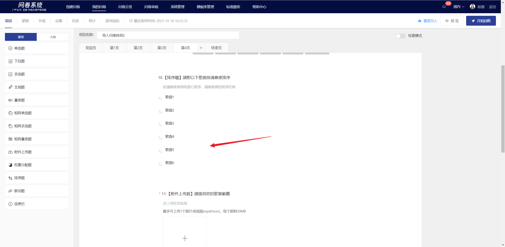

.png>)

## 查看答题数据

在统计页的“答题数据”可查看每个答题者对本题选项的排序情况。

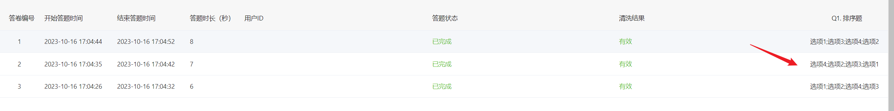

## 统计结果展示

在统计分析页中，可查看本题中各选项的排名情况。

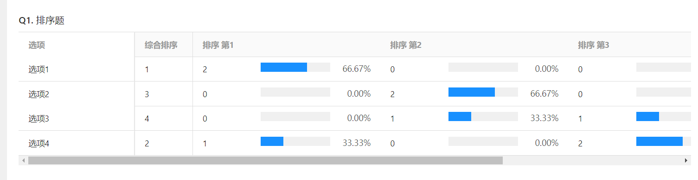


综合排名计算方式

1. **计算公式** 每个选项的总分=分数1 \* 排序第1的答题者数量 + 分数2 \* 排序第2的答题者数量 + 分数3 \* 排序第3的答题者数量 + ... + 分数x \* 排序第x的答题者数量，其中分数1=x，分数2=x-1，分数3=x-2，分数x=1&#x20;
2. x跟题目设置的数量限制有关： 【数量不限】x=本题的总选项数（自由选项+关联选项） 【数量限制为x】x
3. 按各选项的总分从高到低排序，越高排序越前

注意：如有总分相同，则排名一样，下一个分数的排名往后推&#x20;

例 第二名总分为48，有三个同分，则此三项的综合排序都是2，下一个总分47的综合排序是5

