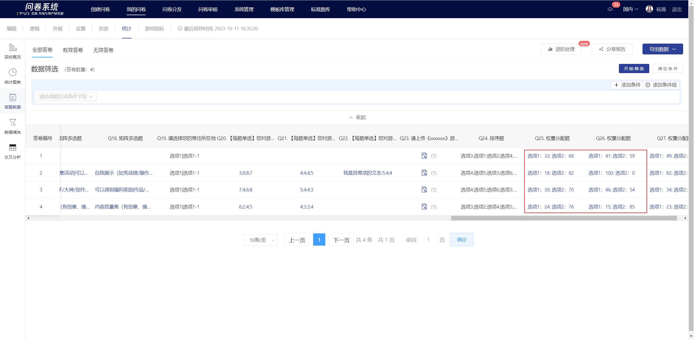
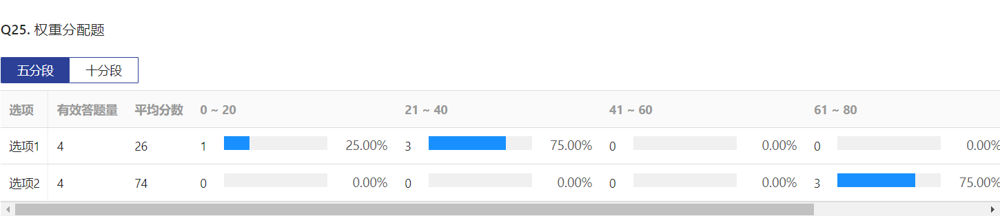

# Slider

The Slider requires respondents to allocate a certain total weight to several choices to indicate the importance or priority of each choice. It is applicable in scenarios where survey respondents' attitudes towards multiple choices are being assessed.

<figure><figcaption></figcaption></figure>

## 【STEP 1】New Slider

In the survey editing page, you can create a question by selecting "Slider" from the question type controls on the left side, or by clicking the + button in the quick toolbar on the right side of the specified question and selecting "Slider".

## 【STEP 2】Edit title, notes, and option content

The title, choices, and remarks all support rich text editing, including: font styles.Insert hyperlink, insert image, insert video, quote survey content.

<figure><figcaption></figcaption></figure>

## 【STEP 3】Question Setting

### Mandatory choice settings

After turning off the "This question is mandatory" feature in the right panel, this question can be left blank when answering.


All questions have the "mandatory question" feature enabled by default.


<figure><figcaption></figcaption></figure>

### Choice Association

Choice association means that the choices selected (or not selected) by the respondent are displayed as options in the next question. It is generally used in cases where two questions are highly related or in follow-up questions.

<figure><figcaption></figcaption></figure>

### Adjust the sum of weights

The weight distribution question supports adjusting the total weight: a total of 100 or a total of 10.


With survey response data already collected, the total weight cannot be adjusted further.


<figure><figcaption></figcaption></figure>

### Choice is random

In the question editing state, you can set the choices to be random. Once set successfully, the choices will be displayed randomly on the answering end according to the selected random method. The random methods include: random order, random forward and reverse order, and grouped display.

<figure><figcaption></figcaption></figure>

#### 选项随机排序

选项随机排序是指答题时题目中的选项以随机顺序出现。开启“选项随机排序”功能后，题目的选项右侧会出现不随机的勾选框，若希望某个选项固定在当前位置，可在其后勾选“不随机”，则该选项不参与随机排序。

#### 选项随机正逆序

选项随机正逆序是指答题时题目中的选项随机以正序/逆序出现。开启“选项随机正逆序”功能后，“选项随机正逆序”功能下方会出现“固定最后一个选项”功能开关，若希望最后一个选项固定在当前位置，可开启“固定最后一个选项”功能，则在答题端显示时最后一个选项不参与随机正逆序。

#### 选项分组显示

选项分组显示是指把选项自由划分为多个组别，答题时每个分组的选项随机抽出一个或多个显示，支持分组间随机排序显示。

## 答题端显示

编辑完成后，在答题端内可查看当前权重分配题效果。

.png>)

## 查看答题数据

在统计页的“答题数据”可查看每个答题者对本题选项的打分情况。

## 统计结果展示

在统计分析页中，可查看本题中各选项的分值情况。当设置权重总和为100时，系统将自动均分为5个分段、10个分段，可按需切换查看。

