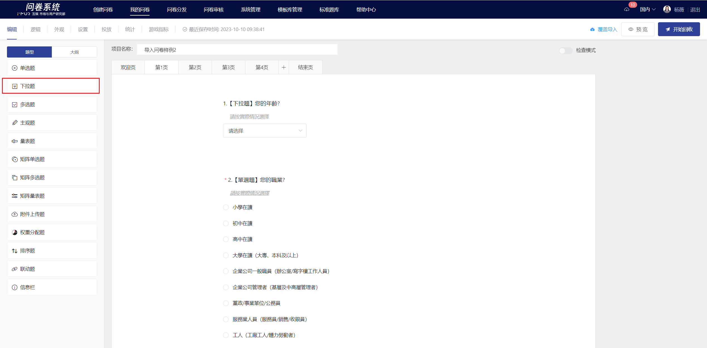
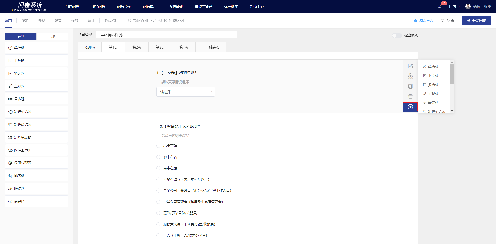
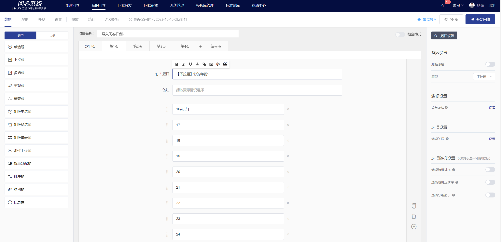
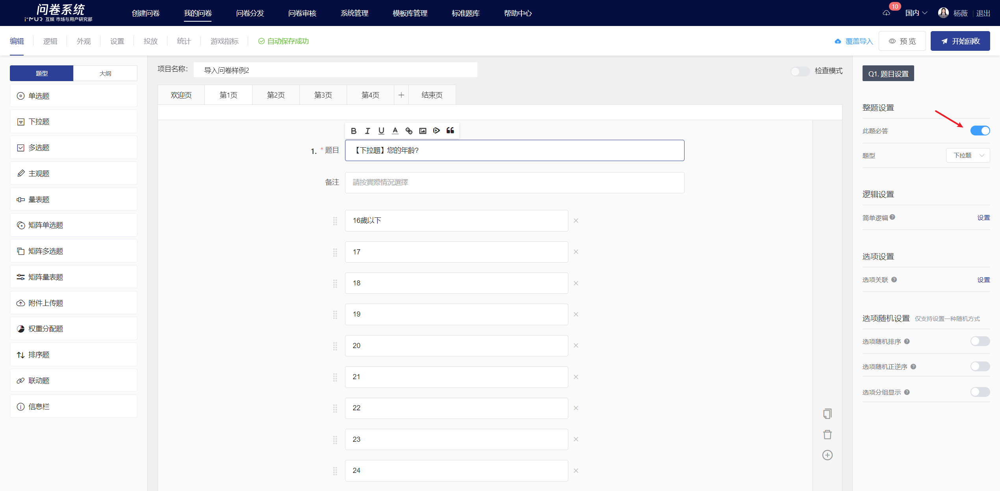
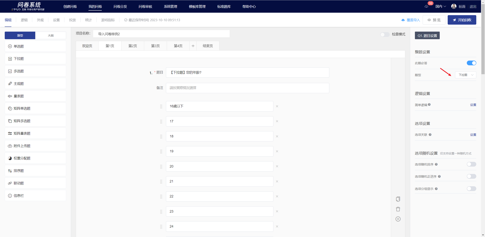
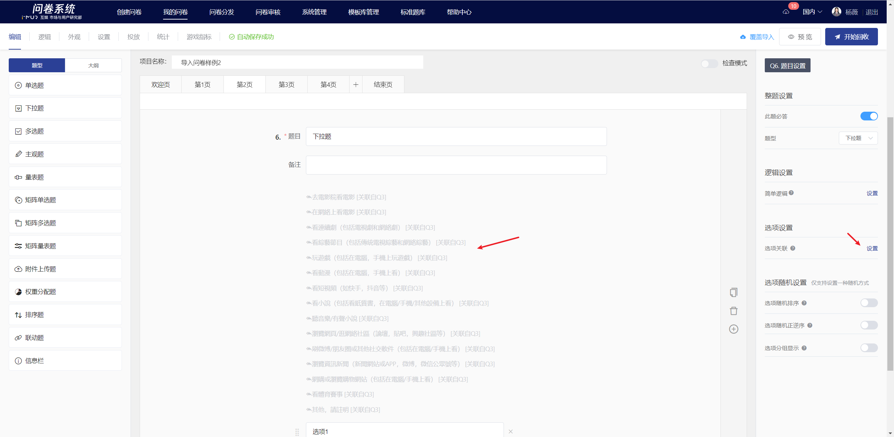
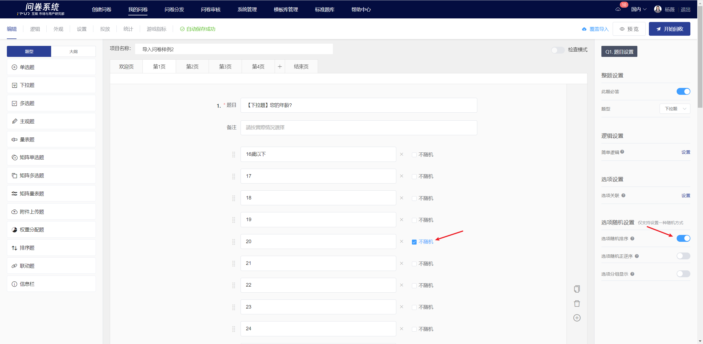
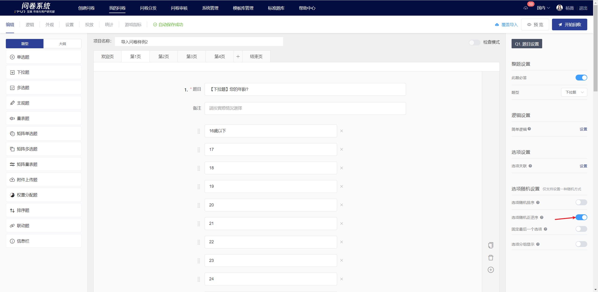
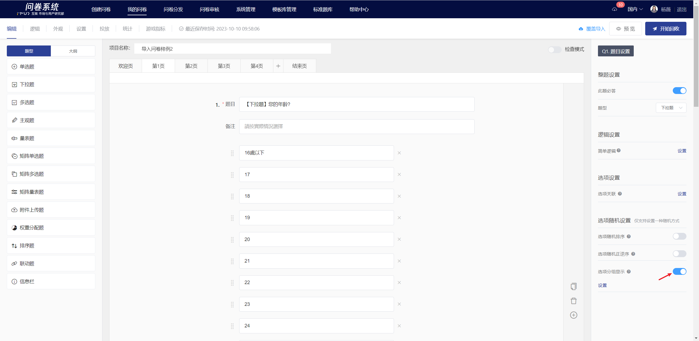
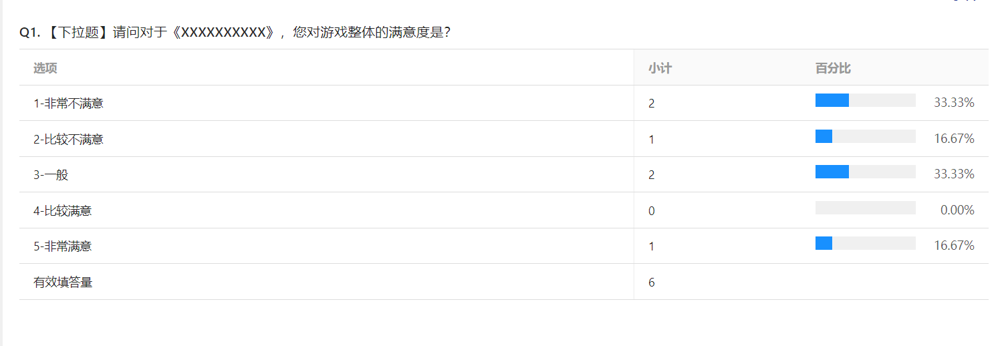

# Dropdown

Dropdown allow respondents to select an answer from a preset group of options by clicking on a dropdown menu. This is suitable for scenarios with a large number of options.

.png>)

## 【STEP 1】 Create new dropdown question

On the survey editing page, select "Dropdown Question" from the question type controls on the left, or click the + button in the quick toolbar on the right side of the specified question to choose "Dropdown Question" to create a new dropdown question.

## 【STEP 2】Edit the question, notes, and options content

The title, options, and remarks all support rich text editing, including: font styles.[插入超链接](../../cao-zuo-zhi-yin/wen-juan-bian-ji/cha-ru-chao-lian-jie.md)、[插入图片](../../cao-zuo-zhi-yin/wen-juan-bian-ji/cha-ru-tu-pian.md)、[插入视频](../../cao-zuo-zhi-yin/wen-juan-bian-ji/cha-ru-shi-pin.md)、[引用选项内容](../../cao-zuo-zhi-yin/wen-juan-bian-ji/nei-rong-yin-yong.md)。

## 【STEP 3】Question and Option Settings

### Mandatory setting

After turning off the "Required" feature in the right panel, this question can be left blank when answering.


All questions are set to "mandatory" by default.


### Switch Question Type

You can freely switch between single-choice questions, multiple-choice questions, and dropdown questions. After switching, the mandatory answer settings, option association settings, and option randomization settings of the original question will be retained.

### Option Association

Option association means that the options selected (or not selected) by the respondent will appear as options in the next question. This is generally used in cases where two questions are highly related or in follow-up questions.


[xuan-xiang-guan-lian.md](../../cao-zuo-zhi-yin/wen-juan-bian-ji/xuan-xiang-she-zhi/xuan-xiang-guan-lian.md)


### Random options

In the question editing mode, you can set options to be randomized. Once set successfully, the options will be displayed on the answering end according to the selected randomization method. The randomization methods include: random order, random forward and reverse order, and grouped display.

#### Randomize options

Option randomization refers to presenting the options in a question in a random order when answering. Once the "Option Randomization" feature is enabled, a "Not Random" checkbox will appear on the right side of each option. If you wish to keep a particular option in its current position, you can check the "Not Random" box, and that option will not be included in the randomization.

#### Options in random forward and reverse order

Random forward/reverse order of options means that the options in the question will appear in a random forward or reverse order when answering. After enabling the "Random forward/reverse order of options" feature, a "Fix the last option" toggle will appear below the "Random forward/reverse order of options" feature. If you wish to keep the last option fixed in its current position, you can enable the "Fix the last option" feature, so that the last option will not participate in the random forward/reverse order when displayed on the answering end.

#### Grouped display of options

Option grouping display refers to freely dividing options into multiple groups, and during the survey, one or more options from each group are randomly selected for display, supporting random sorting display between groups.


[xuan-xiang-sui-ji.md](../../cao-zuo-zhi-yin/wen-juan-bian-ji/xuan-xiang-she-zhi/xuan-xiang-sui-ji.md)


## Display of the editing page and the survey answering interface

After editing, you can view the specific content of the single-choice questions and the association of options, content references, and fill-in-the-blank settings on the editing page.

.png>)

.png>)

### Survey Results

In the statistical analysis page, display the response results of the dropdown question in the form of subtotal + bar percentage.

