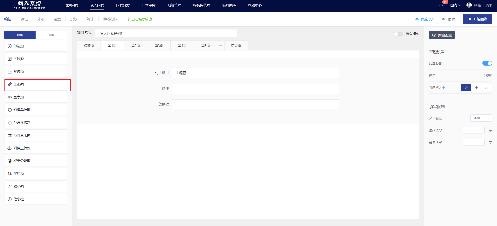
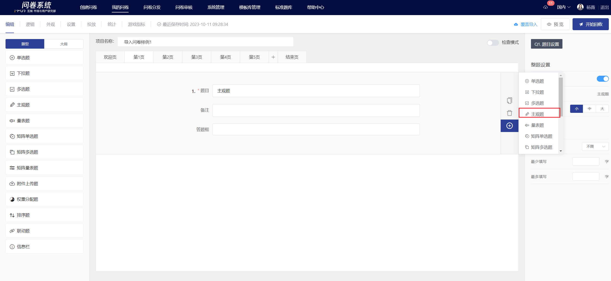
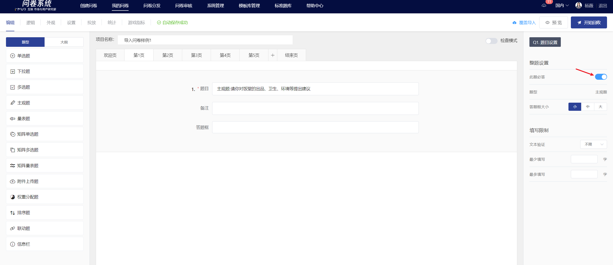
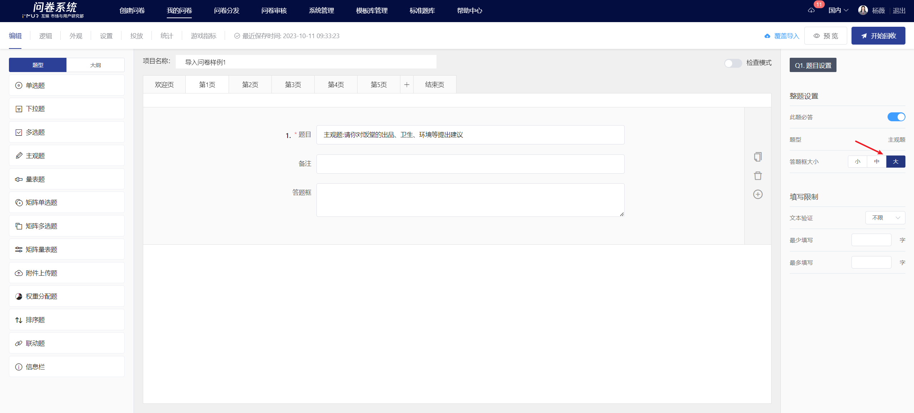
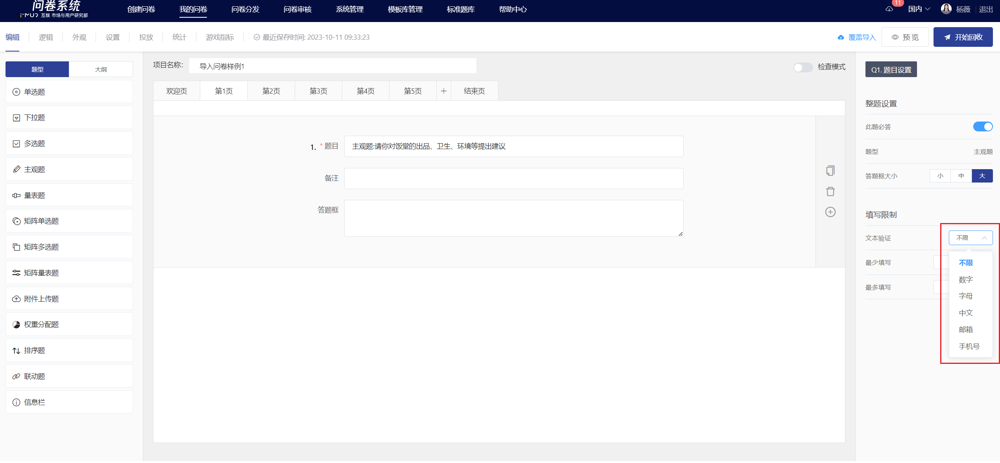
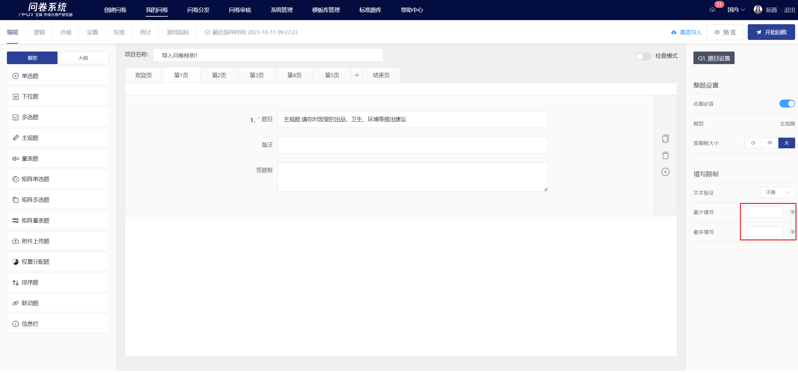
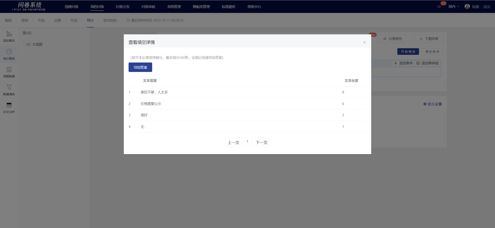

# Text entry

Text entry allow respondents to provide open-ended answers to the questions, supporting a customizable range of word counts and text validation.

.png>)

## 【STEP 1】 Create new text entry

In the survey editing page, you can create a new subjective question by selecting "Subjective Question" from the question type controls on the left, or by clicking the + button in the quick toolbar on the right of a specified question and selecting "Subjective Question".

## 【STEP 2】Edit title, notes, and option content

The title, options, and remarks all support rich text editing, including font styles.[插入超链接](../../cao-zuo-zhi-yin/wen-juan-bian-ji/cha-ru-chao-lian-jie.md)、[插入图片](../../cao-zuo-zhi-yin/wen-juan-bian-ji/cha-ru-tu-pian.md)、[插入视频](../../cao-zuo-zhi-yin/wen-juan-bian-ji/cha-ru-shi-pin.md)、[引用选项内容](../../cao-zuo-zhi-yin/wen-juan-bian-ji/nei-rong-yin-yong.md)。

.png>)

## 【STEP 3】Survey Setup

### Required settings

After turning off the "Required" function in the right panel, this question can be left blank when answering.


All questions have the "mandatory" function enabled by default.


### Answer box size

The size of the answer box for subjective questions can be freely set according to the survey needs. "Small" is for single line, suitable for filling in information such as name and phone number; "Medium" is for two lines; "Large" is for three lines, suitable for opinion collection and other survey scenarios.

### Text Verification

In the question editing state, you can set the text validation method. Once set successfully, the subjective question answers will be validated on the answering end according to the selected validation method. The validation methods include: numbers, letters, Chinese characters, email, and phone number.


If the mobile number is 13 digits long, the character limit set after verifying the mobile number will become invalid.


### Word Count Range

The length of the answers to subjective questions can be limited. Once set successfully, the system will automatically validate the respondents' answers based on the specified length range on the answering end.


If the "minimum fill" and "maximum fill" input fields are empty, no restrictions will be set.


### Editor page and survey response interface

After editing, you can view the specific content of the subjective questions and the answer box settings on the editing page.

.png>)

.png>)

### Survey Results

On the statistical analysis page, the answers to subjective questions are displayed in a list format. Clicking "Export Answers" allows you to export all the detailed answers to the question (to be downloaded in offline download).

